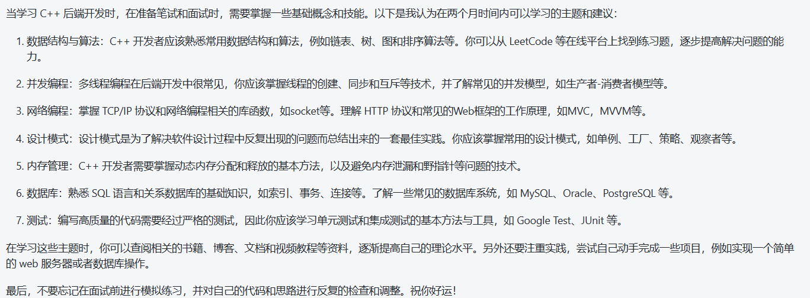

  

# 一、c/c++语言基础
## 1、基础
# 二、计算机网络基础
## 1、计算机体系模型
### 1.6、DNS的工作过程及原理
DNS 协议提供通过域 名查找 IP 地址，或逆向从 IP 地址反查域名的服务。
-   DNS解析有两种方式：递归查询和迭代查询
-   **递归查询**：用户先向本地域名服务器查询，如果本地域名服务器的缓存没有IP地址映射记录，就向根域名服务器查询，根域名服务器就会向顶级域名服务器查询，顶级域名服务器向权限域名服务器查询，查到结果后依次返回。
-  **迭代查询**：用户向本地域名服务器查询，如果没有缓存，本地域名服务器会向根域名服务器查询，根域名服务器返回顶级域名服务器的地址，本地域名服务器再向顶级域名服务器查询，得到权限域名服务器的地址，本地域名服务器再向权限域名服务器查询得到结果。

## 3、HTTP协议

