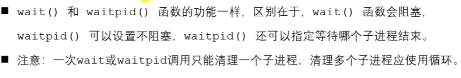
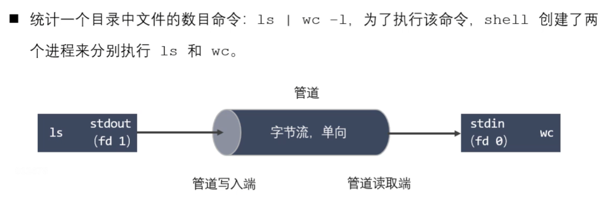
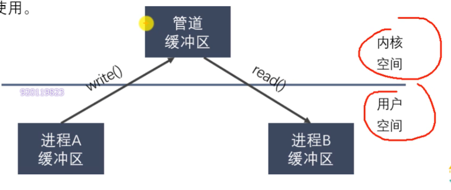

- [第一章：linux系统编程入门学习](#第一章linux系统编程入门学习)
  - [vscode更新弹出报错](#vscode更新弹出报错)
  - [静态库的优缺点](#静态库的优缺点)
  - [动态库的优缺点](#动态库的优缺点)
  - [Makefile](#makefile)
    - [Makefile命名与规则](#makefile命名与规则)
- [Linux指令学习](#linux指令学习)
  - [Linux下“/”和“~”的区别](#linux下和的区别)
  - [__删除命令__](#删除命令)
    - [rm -rf ：删除文件夹](#rm--rf-删除文件夹)
    - [rm :删除文件](#rm-删除文件)
    - [rmdir:删除空的目录](#rmdir删除空的目录)
  - [touch命令](#touch命令)
  - [vim](#vim)
    - [__Esc__:退出编辑模式](#esc退出编辑模式)
    - [__:wq__ 保存并退出，注意有冒号](#wq-保存并退出注意有冒号)
  - [Zip命令：压缩Zip文件](#zip命令压缩zip文件)
  - [unzip命令：解压zip文件](#unzip命令解压zip文件)
  - [GDB命令](#gdb命令)
    - [启动、退出、查看代码](#启动退出查看代码)
    - [调试命令](#调试命令)
  - [mv命令：命令用来为文件或目录改名、或将文件或目录移入其它位置。](#mv命令命令用来为文件或目录改名或将文件或目录移入其它位置)
  - [mkdir命令：用于创建目录（文件夹）、](#mkdir命令用于创建目录文件夹)
  - [01标准c库IO函数](#01标准c库io函数)
  - [02标准c库IO和linux系统IO的关系](#02标准c库io和linux系统io的关系)
  - [03虚拟地址空间](#03虚拟地址空间)
  - [04文件描述符](#04文件描述符)
  - [linux系统IO函数](#linux系统io函数)
    - [open函数](#open函数)
    - [read函数](#read函数)
    - [write函数](#write函数)
  - [文件属性操作函数](#文件属性操作函数)
    - [access函数](#access函数)
    - [chmod函数](#chmod函数)
    - [truncate函数](#truncate函数)
  - [目录操作函数](#目录操作函数)
    - [mkdir函数:创建目录](#mkdir函数创建目录)
    - [rename函数](#rename函数)
    - [chdir函数：修改进程的工作目录 \& getcwd函数：获取当前工作目录](#chdir函数修改进程的工作目录--getcwd函数获取当前工作目录)
  - [目录遍历函数 opendir函数；readdir函数；closedir函数](#目录遍历函数-opendir函数readdir函数closedir函数)
    - [函数详解](#函数详解)
    - [函数示例-readDirNum](#函数示例-readdirnum)
  - [dup函数、dup2函数](#dup函数dup2函数)
- [第二章 Linux多进程开发](#第二章-linux多进程开发)
  - [2.2 进程状态转换](#22-进程状态转换)
    - [进程的状态](#进程的状态)
    - [进程相关命令](#进程相关命令)
      - [查看进程](#查看进程)
    - [进程号和相关函数](#进程号和相关函数)
  - [进程创建](#进程创建)
    - [fork - 创建子进程](#fork---创建子进程)
      - [如果在程序中连续调用两次fork函数，会产生几个进程](#如果在程序中连续调用两次fork函数会产生几个进程)
    - [父子进程虚拟地址空间](#父子进程虚拟地址空间)
    - [父子进程的虚拟地址](#父子进程的虚拟地址)
  - [进程退出 exit函数（标准c库） \& \_exit函数（linux）](#进程退出-exit函数标准c库--_exit函数linux)
  - [孤儿进程](#孤儿进程)
  - [僵尸进程](#僵尸进程)
  - [进程回收](#进程回收)
    - [wait](#wait)
    - [waitpid](#waitpid)
    - [退出信息相关宏函数](#退出信息相关宏函数)
  - [GDB多进程调试](#gdb多进程调试)
    - [设置调试父进程或者子进程：set follow-fork-mode \[parent | child\]](#设置调试父进程或者子进程set-follow-fork-mode-parent--child)
    - [设置调试模式：set detach-on-fork \[on | off\]](#设置调试模式set-detach-on-fork-on--off)
    - [info inferiors ：查看调试的进程](#info-inferiors-查看调试的进程)
    - [inferior id ：切换当前调试的进程](#inferior-id-切换当前调试的进程)
    - [detach inferior id ：使进程脱离GDB调试](#detach-inferior-id-使进程脱离gdb调试)
  - [exec函数族](#exec函数族)
    - [execl函数](#execl函数)
    - [execlp函数](#execlp函数)
  - [进程间通信](#进程间通信)
    - [Linux进程间通信的方式](#linux进程间通信的方式)
    - [匿名管道](#匿名管道)
    - [管道的特点](#管道的特点)
      - [为什么可以使用管道进行进程间通信](#为什么可以使用管道进行进程间通信)
      - [管道的数据结构](#管道的数据结构)
    - [匿名管道的使用](#匿名管道的使用)
      - [设置管道非阻塞](#设置管道非阻塞)
    - [有名管道](#有名管道)
    - [有名管道的使用](#有名管道的使用)
    - [内存映射](#内存映射)
      - [内存映射的注意事项](#内存映射的注意事项)
    - [信号](#信号)
      - [查看信号的详细信息：man 7 signal](#查看信号的详细信息man-7-signal)
    - [kill、raise、abort函数](#killraiseabort函数)
    - [signal函数](#signal函数)
      - [概要](#概要)
      - [描述](#描述)
    - [信号集](#信号集)
      - [阻塞信号集合未决信号集](#阻塞信号集合未决信号集)
    - [SIGCHLD信号](#sigchld信号)

红色
蓝色
黄色
黄绿色

# 第一章：linux系统编程入门学习
## vscode更新弹出报错
  
- __解决方法__：找到报错文件夹，右键-属性-安全-user的权限拉满

-Ctrl+L 一键清空命令行

## 静态库的优缺点
  
## 动态库的优缺点
  

## Makefile
  
### Makefile命名与规则
  

# Linux指令学习
## Linux下“/”和“~”的区别
”/“是根目录，”~“是家目录。
~~~
#家目录
cd
cd ~
#根目录
cd /
~~~
## __删除命令__
### rm -rf ：删除文件夹 
~~~
rm -rf xxx/xx
~~~
### rm :删除文件
~~~
rm xxx.xx
~~~
### rmdir:删除空的目录
- 语法
~~~
rmdir [-p] dirName
~~~
- 参数
-p 是当子目录被删除后使它也成为空目录的话，则顺便一并删除。
## touch命令
touch命令用于修改文件或者目录的时间属性，包括存取时间和更改时间。若文件不存在，系统会建立一个新的文件。
- 语法
~~~
touch [-acfm][-d<日期时间>][-r<参考文件或目录>] [-t<日期时间>][--help][--version][文件或目录…]
~~~

## vim
### __Esc__:退出编辑模式
### __:wq__ 保存并退出，注意有冒号

## Zip命令：压缩Zip文件
- 语法
~~~
zip [选项] [压缩文件] [文件]
~~~
  

## unzip命令：解压zip文件
- 语法
~~~
unzip [选项] 压缩包名
~~~
  

## GDB命令
### 启动、退出、查看代码
- 准备工作
~~~
gcc -g -Wall program.c -o program
# -g的作用是在可执行文件中加入源代码的信息
~~~
- 启动和退出
~~~
gdb [可执行（调试）文件]
quit
~~~
- 给程序设置参数/获取设置参数
~~~
set args 10 20
show args
~~~
- GDB使用帮助
~~~
help
~~~
- 查看当前文件代码
~~~
#list/l是list或l
list/l        #从默认位置显示
list/l 行号   #从指定的行显示
list/l 函数名 #从指定的函数显示
~~~
- 查看非当前文件代码
~~~
list/l 文件名：行号
list/l 文件名：函数名
~~~
- 设置显示的行数
~~~
show list/listsize
set list/listsize
~~~
- 设置断点
~~~
b/break 行号
b/break 函数名
b/break 文件名：行号
b/break 文件名：函数
~~~
- 查看断点
~~~
i/info b/break
~~~
- 删除断点
~~~
d/del/delete 断点编号
~~~
- 设置断点无效/有效
~~~
dis/disable 断点编号
ena/enalbe 断点编号
~~~

- 设置条件断点（一般在循环的位置）
~~~
b/break 10 if i==5
~~~

### 调试命令
- 运行GDB程序
~~~
start(程序停在第一行)
run（遇到断点才停）
~~~
- 继续运行，到下一个断点才停
~~~
c/continue
~~~
- 向下执行一行代码（不会进入函数体）
~~~
n/next
~~~
- 变量操作
~~~
p/print 变量名 （打印变量值）
ptype 变量名 （打印变量类型）
~~~
- 向下单步调试（遇到函数进入函数体）
~~~
s/step
finish(跳出函数体)
~~~
- 自动变量操作
~~~
display num（自动打印指定变量的值）
i/info display
undisplay 编号
~~~
- 其他操作
~~~
set var 变量名=变量值
until （跳出循环）
~~~

## mv命令：命令用来为文件或目录改名、或将文件或目录移入其它位置。

## mkdir命令：用于创建目录（文件夹）、
- 语法
~~~
mkdir [-p] dirName
# -p确保目录名称存在，不存在就建一个
~~~

## 01标准c库IO函数
  
## 02标准c库IO和linux系统IO的关系
  
## 03虚拟地址空间
  

## 04文件描述符
  
- 文件描述符表是数组 因为一个进程可以同时打开多个文件
- 大小默认是1024：最大能同时打开文件的个数1024个
- linux：一切皆文件

## linux系统IO函数
  

### open函数
- 函数详解：
~~~c
/*
    #include <sys/types.h>
    #include <sys/stat.h>
    #include <fcntl.h>
    //打开一个已经存在的文件
    int open(const char *pathname, int flags);
        参数：
            - pathname：要打开的文件路径
            - flags：对文件的操作权限设置还有其他的设置
             O_RDONLY（只读）, O_WRONLY（只写）, or O_RDWR（可读可写），这三个设置是互斥的
        返回值:The return value of open() is a file descriptor(文件描述符)，调用失败返回-1
    errno：属于linux系统函数库，库里的一个全局变量，记录的是最近的错误号
    #include <stdio.h>
    void perror(const char *s);
    作用：打印errno对应的错误描述
        s参数：用户描述，比如hello，最终输出的内容是hello：xxx（实际的错误描述
    //创建一个新的文件
    int open(const char *pathname, int flags, mode_t mode);
*/
~~~
- 函数示例：
~~~c
#include <sys/types.h>
#include <sys/stat.h>
#include <fcntl.h>
#include <stdio.h>
#include <unistd.h>

int main(){
    int fd = open("a.txt",O_RDONLY);
    if(fd == -1){
        perror("open");
    }
    //读写操作

    //关闭
    close(fd);

    return 0;
}
~~~
### read函数  
- 函数详解：
~~~
#include <unistd.h>
ssize_t read(int fd, void *buf, size_t count);
        参数：
                - fd：文件描述符，open得到的，通过文件描述符操作某个文件
                - buf:需要读取数据存放的地方，数组的地址(传出参数)
                - count：指定的数组的大小
        返回值：
                - 成功：
                        >0:返回实际的读取到的字节数
                        =0：文件已经读取完了
                - 失败：-1，并设置errno
~~~
- 函数示例：
~~~
~~~
### write函数
- 函数详解：
~~~c
/*
#include <unistd.h>

ssize_t write(int fd, const void *buf, size_t count);
        参数：
                - fd：文件描述符，open得到，通过这个文件描述符操作某个文件
                - buf：要往磁盘写入的数据
                - count；要写的数据的实际的大小
        返回值：
                成功：实际写入的字节数
                失败：-1，并设置errno
*/
~~~
## 文件属性操作函数
  

### access函数
- 函数详解
~~~c
/*
    #include <unistd.h>
    int access(const char *pathname, int mode);
        作用：判断某个文件是否有某个权限，或者判断文件是否存在
        参数：
            - pathname: 判断的文件路径
            - mode:
                R_OK: 判断是否有读权限
                W_OK: 判断是否有写权限
                X_OK: 判断是否有执行权限
                F_OK: 判断文件是否存在
        返回值：成功返回0， 失败返回-1
*/
~~~
- 函数示例：
~~~c
#include <unistd.h>
#include <stdio.h>

int main() {

    int ret = access("a.txt", F_OK);
    if(ret == -1) { 
        perror("access");
    }

    printf("文件存在！！!\n"); 

    return 0;
}
~~~
### chmod函数
~~~c
/*
    #include <sys/stat.h>
    int chmod(const char *pathname, mode_t mode);
        修改文件的权限
        参数：
            - pathname: 需要修改的文件的路径
            - mode:需要修改的权限值，八进制的数
        返回值：成功返回0，失败返回-1

*/
~~~
- 函数示例：
~~~c
#include <sys/stat.h>
#include <stdio.h>
int main() {

    int ret = chmod("a.txt", 0777);

    if(ret == -1) {
        perror("chmod");
        return -1;
    }

    return 0;
}
~~~
### truncate函数
- 函数详解：
~~~c
/*
    #include <unistd.h>
    #include <sys/types.h>
    int truncate(const char *path, off_t length);
        作用：缩减或者扩展文件的尺寸至指定的大小
        参数：
            - path: 需要修改的文件的路径
            - length: 需要最终文件变成的大小
        返回值：
            成功返回0， 失败返回-1
*/
~~~
- 函数示例：
~~~c
#include <unistd.h>
#include <sys/types.h>
#include <stdio.h>

int main() {

    int ret = truncate("b.txt", 5);

    if(ret == -1) {
        perror("truncate");
        return -1;
    }

    return 0;
}
~~~

## 目录操作函数
  
### mkdir函数:创建目录
- 函数详解：
~~~c
/*
    #include <sys/stat.h>
    #include <sys/types.h>
    int mkdir(const char *pathname, mode_t mode);
        作用：创建一个目录
        参数：
            pathname: 创建的目录的路径
            mode: 权限，八进制的数
        返回值：
            成功返回0， 失败返回-1
*/
~~~
- 函数示例：
~~~c
#include <sys/stat.h>
#include <sys/types.h>
#include <stdio.h>

int main() {

    int ret = mkdir("aaa", 0777);

    if(ret == -1) {
        perror("mkdir");
        return -1;
    }

    return 0;
}
~~~
### rename函数
- 函数详解：
~~~c
/*
    #include <stdio.h>
    int rename(const char *oldpath, const char *newpath);

*/
~~~
- 函数示例：
~~~c
#include <stdio.h>

int main() {

    int ret = rename("aaa", "bbb");

    if(ret == -1) {
        perror("rename");
        return -1;
    }

    return 0;
}
~~~

### chdir函数：修改进程的工作目录 & getcwd函数：获取当前工作目录

- 函数详解：
~~~c
/*

    #include <unistd.h>
    int chdir(const char *path);
        作用：修改进程的工作目录
            比如在/home/nowcoder 启动了一个可执行程序a.out, 进程的工作目录 /home/nowcoder
        参数：
            path : 需要修改的工作目录

    #include <unistd.h>
    char *getcwd(char *buf, size_t size);
        作用：获取当前工作目录
        参数：
            - buf : 存储的路径，指向的是一个数组（传出参数）
            - size: 数组的大小
        返回值：
            返回的指向的一块内存，这个数据就是第一个参数

*/
~~~
- 函数示例：
~~~c
#include <unistd.h>
#include <stdio.h>
#include <sys/stat.h>
#include <sys/types.h>
#include <fcntl.h>

int main() {

    // 获取当前的工作目录
    char buf[128];
    getcwd(buf, sizeof(m));
    printf("当前的工作目录是：%s\n", buf);

    // 修改工作目录
    int ret = chdir("/home/nowcoder/Linux/lesson13");
    if(ret == -1) {
        perror("chdir");
        return -1;
    }

    // 创建一个新的文件
    int fd = open("chdir.txt", O_CREAT | O_RDWR, 0664);
    if(fd == -1) {
        perror("open");
        return -1;
    }

    close(fd);

    // 获取当前的工作目录
    char buf1[128];
    getcwd(buf1, sizeof(buf1));
    printf("当前的工作目录是：%s\n", buf1);

    return 0;
}
~~~

## 目录遍历函数 opendir函数；readdir函数；closedir函数

### 函数详解
~~~c
/*
    // 打开一个目录
    #include <sys/types.h>
    #include <dirent.h>
    DIR *opendir(const char *name);
        参数：
            - name: 需要打开的目录的名称
        返回值：
            DIR * 类型，理解为目录流
            错误返回NULL

    // 读取目录中的数据
    #include <dirent.h>
    struct dirent *readdir(DIR *dirp);
        - 参数：dirp是opendir返回的结果
        - 返回值：
            struct dirent，代表读取到的文件的信息
            读取到了末尾或者失败了，返回NULL

    // 关闭目录
    #include <sys/types.h>
    #include <dirent.h>
    int closedir(DIR *dirp);

*/
~~~
### 函数示例-readDirNum
~~~c
#include <sys/types.h>
#include <dirent.h>
#include <stdio.h>
#include <string.h>
#include <stdlib.h>

int getFileNum(const char * path);

// 读取某个目录下所有的普通文件的个数
int main(int argc, char * argv[]) {

    if(argc < 2) {
        printf("%s path\n", argv[0]);
        return -1;
    }

    int num = getFileNum(argv[1]);

    printf("普通文件的个数为：%d\n", num);

    return 0;
}

// 用于获取目录下所有普通文件的个数
int getFileNum(const char * path) {

    // 1.打开目录
    DIR * dir = opendir(path);

    if(dir == NULL) {
        perror("opendir");
        exit(0);
    }

    struct dirent *ptr;

    // 记录普通文件的个数
    int total = 0;

    while((ptr = readdir(dir)) != NULL) {

        // 获取名称
        char * dname = ptr->d_name;

        // 忽略掉. 和..
        if(strcmp(dname, ".") == 0 || strcmp(dname, "..") == 0) {
            continue;
        }

        // 判断是否是普通文件还是目录
        if(ptr->d_type == DT_DIR) {
            // 目录,需要继续读取这个目录
            char newpath[256];
            sprintf(newpath, "%s/%s", path, dname);
            total += getFileNum(newpath);
        }

        if(ptr->d_type == DT_REG) {
            // 普通文件
            total++;
        }

    }

    // 关闭目录
    closedir(dir);

    return total;
}
~~~
## dup函数、dup2函数
  

- 阻塞和非阻塞：描述的是函数调用的行为

# 第二章 Linux多进程开发

## 2.2 进程状态转换
### 进程的状态
- 三个基本状态：就绪态，运行态，阻塞态
  
就绪态:资源都有了，没有运行权
阻塞态不能直接进入运行态，要先进入就绪态

  

### 进程相关命令
####  查看进程
  
- STAT参数意义
  

- 实时显示进程动态：top
  
- 杀死进程 kill

### 进程号和相关函数
  

## 进程创建
### fork - 创建子进程  
- 头文件
~~~c
#include <sys/types.h>
#include <unistd.h>

pid_t fork(void);
~~~
- 返回值
  - 成功：子进程中返回0  父进程中返回子进程ID
  - 失败：返回-1

#### 如果在程序中连续调用两次fork函数，会产生几个进程
~~~c
fork();
fork();
~~~

_答_：会产生包括父进程在内的四个进程  
第一次fork()函数产生一个子进程  
第二次fork(),父进程又产生一个子进程，子进程产生孙子进程

### 父子进程虚拟地址空间
  

### 父子进程的虚拟地址

## 进程退出 exit函数（标准c库） & _exit函数（linux）
  
~~~c
print("hello \n");
print("world");
exit(0) #会输出hello 换行 world
_exit(0) #会输出hello 没有world

~~~

## 孤儿进程
-  父进程运行结束，但子进程还在运行（未运行结束），这样的子进程就被称为孤儿进程
-  每当出现一个孤儿进程的时候，内核就把孤儿进程的父进程设置为init，而init进程会循环的wait()
-  因此孤儿进程没有什么危害

代码示例：
~~~c
#include <sys/types.h>
#include <unistd.h>
#include <stdio.h>

int main() {

    // 创建子进程
    pid_t pid = fork();

    // 判断是父进程还是子进程
    if(pid > 0) {

        printf("i am parent process, pid : %d, ppid : %d\n", getpid(), getppid());

    } else if(pid == 0) {
        sleep(1);
        // 当前是子进程
        printf("i am child process, pid : %d, ppid : %d\n", getpid(),getppid());

    }

    // for循环
    for(int i = 0; i < 3; i++) {
        printf("i : %d , pid : %d\n", i , getpid());
    }

    return 0;
}
~~~

运行结果：子进程的ppid变成1了
  

## 僵尸进程
  

- 代码示例：
~~~c
#include <sys/types.h>
#include <unistd.h>
#include <stdio.h>

int main() {

    // 创建子进程
    pid_t pid = fork();

    // 判断是父进程还是子进程
    if(pid > 0) {
        while(1) {
            printf("i am parent process, pid : %d, ppid : %d\n", getpid(), getppid());
            sleep(1);
        }

    } else if(pid == 0) {
        // 当前是子进程
        printf("i am child process, pid : %d, ppid : %d\n", getpid(),getppid());

    }

    // for循环
    for(int i = 0; i < 3; i++) {
        printf("i : %d , pid : %d\n", i , getpid());
    }

    return 0;
}
~~~

代码运行后查看进程：不能被kill -9 杀死
  

## 进程回收
- 在每个进程退出的时候，内核释放该进程所有的资源、包括打开的文件。占用的内存等，但是仍然为其保留一定的信息，这些信息主要指进程控制块PCB的信息（包括进程号、退出状态、运行时间等）
- 父进程可以通过调用wait或waitpid得到他的退出状态同时彻底清除掉这个进程
  

### wait

### waitpid
~~~c
/*
#include <sys/types.h>
#include <sys/wait.h>

pid_t waitpid(pid_t pid, int *wstatus, int options);
    功能：回收指定进程号的子进程，可以设置是否阻塞
    参数:
        - pid
            pid > 0:某个子进程的pid
            pid = 0：回收当前进程组的所有子进程
            pid = -1：回收所有的子进程，相当于wait()(最常用)
            pid < -1:回收某个进程组的组id的绝地址，回收指定进程组中的子进程，如-5就是
        - options：设置阻塞或者非阻塞
            0：阻塞
            WNOHANG：如果没有子进程退出，立即返回
    返回值：
    > 0 : 返回子进程的id
    = 0 ：options=WNOHANG，表示还有子进程
    = -1 ：错误，或者没有子进程了
~~~
- waitpid()系统调用挂起调用进程的执行，直到由pid参数指定的子进程改变状态。默认情况下，waitpid()只等待被终止的子进程，但是这个行为可以通过options参数修改，如下所述。
- 进程组的pid是当前进程组组长的pid

###  退出信息相关宏函数
  

## GDB多进程调试
使用GDB调试时，GDB默认只能跟踪一个进程，可以在fork函数调用之前，通过指令设置GDB调试工具跟踪父进程或者子进程，默认子进程
### 设置调试父进程或者子进程：set follow-fork-mode [parent | child]

### 设置调试模式：set detach-on-fork [on | off]

### info inferiors ：查看调试的进程

### inferior id ：切换当前调试的进程

### detach inferior id ：使进程脱离GDB调试

## exec函数族
- exec函数族的作用是根据指定的文件名找到可执行文件，并用它来取代调用进程的内容
- exec函数族的函数执行成功后不会返回，因为调用进程的实体，包括代码段，数据 段和堆栈都已经被新的内容取代，只留下进程ID等一些表面上的信息仍保持原样
  

### execl函数
- 函数解释：
~~~c
/*  
    #include <unistd.h>
    int execl(const char *path, const char *arg, ...);
        - 参数：
            - path:需要指定的执行的文件的路径或者名称
                a.out /home/nowcoder/a.out 推荐使用绝对路径
                ./a.out hello world

            - arg:是执行可执行文件所需要的参数列表
                第一个参数一般没有什么作用，为了方便，一般写的是执行的程序的名称
                从第二个参数开始往后，就是程序执行所需要的的参数列表。
                参数最后需要以NULL结束（哨兵）

        - 返回值：
            只有当调用失败，才会有返回值，返回-1，并且设置errno
            如果调用成功，没有返回值。

*/
~~~
- 函数示例：
~~~c
#include <unistd.h>
#include <stdio.h>

int main() {

    // 创建一个子进程，在子进程中执行exec函数族中的函数
    pid_t pid = fork();

    if(pid > 0) {
        // 父进程
        printf("i am parent process, pid : %d\n",getpid());
        sleep(1);
    }else if(pid == 0) {
        // 子进程
        execl("hello","hello",NULL);//hello的作用是输出hello world

        execl("/bin/ps", "ps", "aux", NULL);
        perror("execl");
        printf("i am child process, pid : %d\n", getpid());

    }

    for(int i = 0; i < 3; i++) {
        printf("i = %d, pid = %d\n", i, getpid());
    }

    return 0;
}
~~~
- 运行结果：

  

### execlp函数
- 函数解释：
~~~c
/*  
    #include <unistd.h>
    int execlp(const char *file, const char *arg, ... );
        - 会到环境变量中查找指定的可执行文件，如果找到了就执行，找不到就执行不成功。
        - 参数：
            - file:需要执行的可执行文件的文件名
                a.out
                ps

            - arg:是执行可执行文件所需要的参数列表
                第一个参数一般没有什么作用，为了方便，一般写的是执行的程序的名称
                从第二个参数开始往后，就是程序执行所需要的的参数列表。
                参数最后需要以NULL结束（哨兵）
  
        - 返回值：
            只有当调用失败，才会有返回值，返回-1，并且设置errno
            如果调用成功，没有返回值。

        int execv(const char *path, char *const argv[]);
        argv是需要的参数的一个字符串数组
        char * argv[] = {"ps", "aux", NULL};
        execv("/bin/ps", argv);

        int execve(const char *filename, char *const argv[], char *const envp[]);
        char * envp[] = {"/home/nowcoder", "/home/bbb", "/home/aaa"};

*/
~~~

- 函数示例：
~~~c
#include <unistd.h>
#include <stdio.h>

int main() {

    // 创建一个子进程，在子进程中执行exec函数族中的函数
    pid_t pid = fork();

    if(pid > 0) {
        // 父进程
        printf("i am parent process, pid : %d\n",getpid());
        sleep(1);
    }else if(pid == 0) {
        // 子进程
        execlp("ls", "ls", NULL);

        printf("i am child process, pid : %d\n", getpid());

    }

    for(int i = 0; i < 3; i++) {
        printf("i = %d, pid = %d\n", i, getpid());
    }

    return 0;
}
~~~

- 运行结果
  

## 进程间通信
- 进程是一个独立的资源分配单元，不同进程（这里所说的进程通常指的是用户进程）之间的资源是独立的，没有关联，不能在一个进程中直接访问另一个进程的资源
- 但是，进程不是孤立的，不同的进程需要进行信息的交互和状态的传递等，因此需要进程间通信（IPC）
- 进程间通信的目的：
  - 数据传输：一个进程需要将它的数据发送给另一个进程
  - 通知事件：一个进程需要向另一个或一组进程发送消息，通知它（它们）发生了某种事件（如进程终止时要通知父进程）
  - 资源共享：多个进程之间共享同样的资源。为了做到这一点，需要内核提供互斥和同步机制
  - 进程控制：有些进程希望完全控制另一个进程的执行（如Debug进程），此时控制进程希望能够拦截另一个进程的所有陷入和异常，并能够及时知道它的状态和改变
### Linux进程间通信的方式
  

### 匿名管道
- 管道也叫无名（匿名）管道、
  
图中的竖线被称为管道符

### 管道的特点
- 管道其实是一个在内核内存内维护的缓冲器，这个缓冲器的存储能力是有限的，不同的操作系统大小不一定相同
- 管道拥有文件的特质：读操作、写操作，__<u>匿名管道没有文件实体，有名管道有文件实体，但不存储数据，可以按照操作文件的方式对管道进行操作</u>__
- 一个管道是一个字节流,使用管道时不存在消息或者消息边界的概念，从管道读取数据的进程可以读取任意大小的数据块，而不管写入进程写入管道的数据块的大小是多少
- 通过管道传递的数据是顺序的，从管道中读取出来的字节和它们被写入管道的顺序是完全一样的
- 在管道中的数据传递的方向是 __单向__ 的，一端用于写入，一端用于读取，管道是半双工的。(类似对讲机)
- 从管道中读数据是一次性操作，数据一旦被读走，就被从管道中抛弃，释放空间以便写入更多的数据，在管道中无法使用iseek()来随机的访问数据
- 匿名管道只能在具有公共祖先的进程间使用（父子，兄弟）
-   

#### 为什么可以使用管道进行进程间通信
  

#### 管道的数据结构
  

### 匿名管道的使用
  
- pipe函数详解
~~~c
/*
    #include <unistd.h>
    int pipe(int pipefd[2]);
        功能：创建一个匿名管道，用来进程间通信。
        参数：int pipefd[2] 这个数组是一个传出参数。
            pipefd[0] 对应的是管道的读端
            pipefd[1] 对应的是管道的写端
        返回值：
            成功 0
            失败 -1

    管道默认是阻塞的：如果管道中没有数据，read阻塞，如果管道满了，write阻塞

    注意：匿名管道只能用于具有关系的进程之间的通信（父子进程，兄弟进程）
*/
~~~
#### 设置管道非阻塞
~~~c
/*
    设置管道非阻塞
    int flags = fcntl(fd[0] , F_GETFL); //获取原来的flag
    flags |= O_ONNBLOCK;                //修改flag的值
    fcntl(fd[0] , F_SETFL, flags);      //设置新的flag
*/
~~~

### 有名管道
- 匿名管道只能用于亲缘关系的进程间通信，为了克服这一取点，，提出了有名管道FIFO
- 有名管道（FIFO）不同于匿名管道之处在于它提供了一个路径名与之关联，以FIFO的文件形式存在于文件系统中，并且其打开方式与打开一个普通文件是一样的，通过FIFO不相关的进程也能交换数据
- 有名管道和匿名管道不同点：
  - FIFO在文件系统作为一个特殊文件存在，但FIFO中的内容却存放在内存中
  - 当使用FIFO的进程退出后，FIFO文件将继续保存在文件系统中以便以后使用

### 有名管道的使用
  

### 内存映射
将磁盘文件的数据映射到内存，用户通过修改内存就能修改磁盘文件

#### 内存映射的注意事项
1. 如果对mmap的返回值（ptr）做--

3. 如果文件偏移量为1000会怎样？  
   偏移量必须为4k的整数倍，返回MAP_FAILED
4. mmap什么情况下会调用失败？
   1. 第二个参数：length = 0
   2. 第三个参数：port
      1. 只指定了写权限
5. 可以open的时候O_CREAT一个新文件来创建映射区吗？
   1. 可以的，但是创建的文件的大小如果为0的话，肯定不行
   2. 可以对新的文件进程扩展：lseek() truncate()
6. mmap后关闭文件描述符，对mmap映射有没有影响？

### 信号
#### 查看信号的详细信息：man 7 signal

### kill、raise、abort函数
~~~c
/*  
    #include <sys/types.h>
    #include <signal.h>

    int kill(pid_t pid, int sig);
        - 功能：给任何的进程或者进程组pid, 发送任何的信号 sig
        - 参数：
            - pid ：
                > 0 : 将信号发送给指定的进程
                = 0 : 将信号发送给当前的进程组
                = -1 : 将信号发送给每一个有权限接收这个信号的进程
                < -1 : 这个pid=某个进程组的ID取反 （-12345）
            - sig : 需要发送的信号的编号或者是宏值，0表示不发送任何信号

        kill(getppid(), 9);
        kill(getpid(), 9);
        
    int raise(int sig);
        - 功能：给当前进程发送信号
        - 参数：
            - sig : 要发送的信号
        - 返回值：
            - 成功 0
            - 失败 非0
        kill(getpid(), sig);   

    void abort(void);
        - 功能： 发送SIGABRT信号给当前的进程，杀死当前进程
        kill(getpid(), SIGABRT);
*/
~~~

### signal函数
#### 概要
    #include <signal.h>

    typedef void (*sighandler_t)(int);

    sighandler_t signal(int signum, sighandler_t handler);
#### 描述

### 信号集
- 在PCB中有两个非常重要的信号集，一个称之为 __阻塞信号集__ ,；另一个称之为 __未决信号集__
- 信号的“未决”是一种状态，指的是从信号的产生到信号被处理钱的这一段时间
- 信号的“阻塞”是一个开关动作，指的是阻止信号被处理

#### 阻塞信号集合未决信号集
1. 用户通过键盘 Ctrl+C，产生2号信号SIGINT（信号被创建）
2. 信号产生但是没有被处理（未决）
   - 在内核中将所有的没有被处理的信号存储在一个集合中（未决信号集）
   - SIGINT信号状态被存储在第二个标志位上
     - 这个标志位的值为0，说明信号不是未决状态
     - 这个标志位的值为1，说明信号处于未决状态
3. 这个未决状态的信号，需要被处理，处理之前需要和另一个信号集（阻塞信号集），进行比较
   - 阻塞信号集默认不阻塞任何的信号
   - 如果想要阻塞某些信号，需要用户调用系统的API
4. 处理的时候和阻塞信号集中的标志位进行查询，看是不是对该信号设置阻塞了
   - 如果没有阻塞，这个信号就被处理
   - 如果阻塞了，这个信号就继续处于未决状态，知道阻塞解除，这个信号就被处理
   
### SIGCHLD信号
- 产生的条件
  - 子进程终止时
  - 子进程接收到SIGSTOP信号停止时
  - 子进程处在停止态，接收到SIGCONT后唤醒时
- 以上三种条件都会给父进程发送SIGCHLD信号，父进程默认会忽略该信号