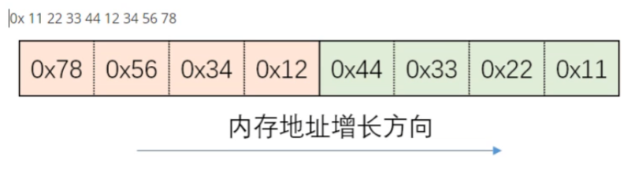

- [一、 __c++基础__](#一-c基础)
  - [1.1 语言基础](#11-语言基础)
    - [1.1.1 简述下C++语言的特点](#111-简述下c语言的特点)
- [二、 __计算机网络基础__](#二-计算机网络基础)
  - [1、 __计算机体系模型__](#1-计算机体系模型)
    - [1.1 各层模型](#11-各层模型)
    - [1.2 协议](#12-协议)
      - [1.2.1 常见协议](#121-常见协议)
      - [UDP协议](#udp协议)
      - [__TCP协议__](#tcp协议)
      - [__IP协议__](#ip协议)
      - [以太网帧协议](#以太网帧协议)
      - [ARP协议-地址解析协议](#arp协议-地址解析协议)
    - [__封装__](#封装)
    - [__分用（解封装）__](#分用解封装)
    - [__socket(套接字)__](#socket套接字)
      - [__字节序__](#字节序)
      - [字节序转换函数](#字节序转换函数)
    - [TCP通信流程](#tcp通信流程)
    - [TCP三次握手](#tcp三次握手)
    - [TCP四次挥手](#tcp四次挥手)
    - [TCP通信并发](#tcp通信并发)
    - [I/O模型](#io模型)
    - [I/O多路复用](#io多路复用)
      - [select](#select)
      - [poll](#poll)
      - [epoll](#epoll)

# 一、 __c++基础__
## 1.1 语言基础
### 1.1.1 简述下C++语言的特点
# 二、 __计算机网络基础__
## 1、 __计算机体系模型__
### 1.1 各层模型
- OSI七层模型：物理层、数据链路层、网络层、传输层、会话层、表示层、应用层
- TCP/IP四层模型：网络接口层、网络层、传输层、应用层
- 五层模型：物理层、数据链路层、网络层、传输层、应用层
    
### 1.2 协议
#### 1.2.1 常见协议
- __应用层__ 常见协议：
  - DNS、Telnet、SMTP、HTTP、
  - FTP (File Transfer Protocol 文件传输协议)
- __传输层__ 常见协议：
  - TCP (Transmission control Protocol 传输控制协议)
  - UDP (user datagram Protocol 用户数据报协议)
- __网络层__ 常见协议：IP (Internet Protocol 因特网互联协议)
  - ICMP、ARP、RARP、OSPF、IPX、RIP、IGRP

#### UDP协议
  
1. 源端口号：发送方端口号
2. 目的端口号：接收方端口号
3. 长度：UDP用户数据报的长度，最小值是8（仅有首部）
4. 校验和：检测UDP用户数据报在传输中是否有错，有错就丢弃

#### __TCP协议__
   1](images/3853135e886ef8cc56bee5269f5ddcdad928226ddd337bf369bf9868b84eb84d.png)  

1. 源端口号：发送方端口号
2. 目的端口号：接收方端口号
3. 六个控制位：
   1. URG
   2. ACK
   3. PSH
   4. RST
   5. SYN
   6. FIN

#### __IP协议__
  

__生存时间TTL__：占8位，表明IP数据报文在网路中的 __寿命__，每经过一个设备（不管是路由器还是计算机），TTL减一，当TTL=0时，网络设备必须丢弃该报文（它解决的就是，当网络报文找不到终点的时候，避免网络报文在网络中无限的传输，以消耗带宽）
__八位协议__:占8位，表明IP数据所携带的具体数据是什么协议的（如TCP、UDP等，一些协议对应的值，可参考下图）
  

#### 以太网帧协议

#### ARP协议-地址解析协议
地址解析协议，即ARP（Address Resolution Protocol），是根据IP地址获取物理地址的一个TCP/IP协议。
- IP寻址的过程（ARP协议工作）
  - Ip寻址的工作原理
  - 本地网络寻址
- ARP数据包-28个字节
  
1. 硬件类型：1表示mac地址
2. 协议类型：0X800表示IP协议
3. 硬件地址长度：1个字节，对于以太网的值为6
4. 协议地址长度：4
5. 操作码：1表示ARP请求，2表示ARP应答
6. __目的逻辑地址__：这是一个可变长度字段，用来定义目标的逻辑 __（IP）__ 地址，对于IPv4协议这个字段的长度为4个字节。

以太网帧头：14个字节
帧总长度 = 帧头 + ARP包头 = 14 + 28 = 42 bytes；  
而真正 发包的时为了保证以太网帧的最小帧长为64 bytes，会在报文里添加一个padding字段，用来填充数据包大小。
报文总长度：64个字节

### __封装__
上层协议是如何使用下层协议提供的服务的呢？是通过封装实现的。应用程序数据在发送到物理网络上之前，将沿着协议栈从上往下依次传递。每层协议都将在上层数据的基础上加上自己的头部信息，以实现该层的功能，这个过程就称为封装。

### __分用（解封装）__
  

### __socket(套接字)__
所谓socket，就是对网络中不同主机上的应用进程之间进行双向通信的端点的抽象，一个套接字就是网络上的进程通信的一端，提供了应用层进程利用网络协议交换数据的机制
- socket是由IP地址和端口结合的，提供向应用层进程传送数据包的机制
- 套接字通信分两部分：（类似插座）
  - 服务器端：被动接受连接，一般不会主动发起连接
  - 客户端：主动向服务器发起连接

#### __字节序__
字节序，顾名思义字节的顺序，就是大于一个字节类型的数据在内存中的存放顺序（一个字节的数据当然就无需谈顺序的问题了）
- 大端字节序
  
~~~
h   - host 主机，主机字节序
to  - 转换成什么
n   - network 网络字节序
s   - short——转换端口
l   - long——转换IP
~~~

- 小端字节序

#### 字节序转换函数
- __网络字节顺序__ 是TCP/IP中规定好的一种数据表示格式，采用大端排序方式
~~~c
unsigned short ntohs(unsigned short);  //将16位的网络字节序转换为
主机字节序
unsigned long ntohl(unsigned long);    //将32位的网络字节序转换为主机字节序
unsigned short htons(unsigned short ); //将16位的主机字节序转换为网络字节序
unsigned long  htonl (unsigned long);  //将32位的主机字节序转换为网络字节序
~~~

### TCP通信流程
~~~c
//TCP和UDP  - 传输层的协议
UDP：用户数据报协议，面向无连接，可以单播，多播，广播，面向数据报，不可靠
tcp：传输控制协议，面向连接的，可靠的、基于字节，仅支持单播传输
~~~
|              | TCP  |  UDP |
| ----------- | ----------- |--|
| 是否创建连接 | 面向连接     |无连接  |
| 是否可靠     | 可靠的        | 不可靠 |
|连接的对象个数| 支持一对一 |一对一、一对多、多对一、多对多|
|传输的方式 |  面向字节流 | 面向数据报 |
|首部开销  |  最少20个字节 |8个字节|
|适用场景 |  可靠性高的应用（文件传输）|  实时应用（视频会议，直播）|

  
~~~c
//TCP通信的流程
//服务器端（接收被动连接的角色）
1. 创建一个用于监听的套接字
  - 监听：监听有客户端的连接
  - 套接字：这个套接字其实就是一个文件描述符
2. 将这个监听的文件描述符和本地的IP和端口绑定（IP和端口就是服务器的地址信息）
  - 客户端连接服务器的时候使用的就是这个IP和端口
3. 设置监听，监听的fd开始工作
4. 阻塞等待，当有客户端发起连接，解除阻塞，接手客户端的连接，会得到与客户端连接的套接字
5.通信
    -接收数据
    -发送数据
6.通信结束，断开连接
~~~

~~~c
//客户端
1.创建一个用于通信的套接字（fd）
2.连接服务器，需要指定连接的服务器的IP和端口
3.连接成功，客户端可以直接和服务器通信
    - 接收数据
    - 发送数据
4.通信结束，断开连接
~~~

### TCP三次握手
- TCP提供了一种可靠、面向连接、字节流、传输层的服务，采用 __三次握手__ 建立一个连接。采用四次挥手来关闭一个连接
- 三次握手发生在客户端连接的时候，当调用connect()

  

### TCP四次挥手
  

  

### TCP通信并发
- 要实现TCP通信服务器处理并发的任务，使用多线程或者多进程解决
思路：  
    1. 一个父进程，多个子进程
    2. 父进程负责等待并接受客户端的连接
    3. 子进程：完成通信，接受一个客户端连接,就创建一个子进程用于通信

### I/O模型
- 阻塞等待
  - 好处：不占用CPU宝贵的时间片
  - 缺点：同一时刻只能处理一个操作，效率低
    - 多线程或者多进程解决-BIO模型
      - 缺点：
        - 1.线程或者进程会消耗资源
        - 2.线程或者进程调度消耗CPU资源
        - __根本问题__：blocking
- 非阻塞，忙轮询
  - 优点：提高了程序的执行效率
  - 缺点：需要占用更多的CPU和系统资源
    - __>使用IO多路转接技术select/poll/epoll__
- IO多路转接技术
  - 第一种：select/poll --委托内核
    - select代收只会告诉你有几个快递到了，但是哪个快递，你需要挨个遍历
  - 第二种：epoll
    - epoll不仅会告诉你有几个快递到了，还会告诉你是哪个快递公司的快递

  
### I/O多路复用
I/O多路复用使得程序能同时监听多个文件描述符，能够提高程序的性能，Linux下实现I/O多路复用的系统调用主要有select、poll和epoll

#### <table><tr><td bgcolor=grey>select</td></tr></table>
__主旨思想__：
  1. 首先要构造一个关于文件描述符的列表，将要监听的文件描述符添加到该列表中。
  2. 调用一个系统函数，监听该列表中的文件描述符，直到这些描述符中的一个或者多个进程I/O操作时，该函数才返回  
    a. 这个函数是阻塞
    b. 函数对文件描述符的检测的操作是由内核完成的
  3. 在返回时，它会告诉进程有多少描述符要进程I/O操作
~~~c
#include <sys/time.h> 
#include <unistd.h> 
 
int select(
int maxfd,    //监听的文件描述符的值最大的一个+1
fd_set * readfds,  //可读事件文件描述符集合
fd_set * writefds,  //可写事件文件描述符集合
struct timeval * timeout //函数监听时间  写 NULL 则变成阻塞等待
);

int fd = open("a.txt",O_CREATE|O_RDONLY,0644);  //获取一个文件描述符
fd_set se;      //声明描述符集合
FD_SET(fd,&se); //将fd这个文件描述符 添加到 文件描述符集合中

int fd = open("a.txt",O_CREATE|O_RDONLY,0644);  //获取一个文件描述符
fd_set se;      //声明描述符集合
FD_CLR(fd,&se); //将fd从文件描述符集合se中清除

FD_ZERO(&se); //清空集合se中的所有位

fd_set se;      
FD_ISSET(fd,&se); //测试指定的文件描述符是否在该集合中
~~~
- fd_set 结构体看做一个整形数组，不超过1024
- select()的缺点：
  1. 每次调用select，都需要把fd集合从用户态拷贝到内核态，这个开销在fd很多时会很大
  2. 每次同时调用select都需要在内核遍历传递进来的所有fd，这个开销在fd很多时也很大
  3. select支持的文件描述符数量太小了，默认是1024
  4. fds集合不能重用，每次都需要重置

#### poll
poll()没有最大文件描述符数量的限制

~~~c
#include <poll.h>

int poll(struct pollfd *fds,//是一个struct pollfd结构体数组，是一个需要检测的文件描述符的集合
nfds_t nfds, //用来指定第一个参数数组元素个数
int timeout); //指定等待的毫秒数，无论 I/O 是否准备好，poll() 都会返回.

struct pollfd{
	int fd;			//文件描述符
	short events;	//等待的事件
	short revents;	//实际发生的事件
};

~~~
|`timeout值` |`说明`|
|:----:|:----:|
|-1 | 阻塞 |
|0  |不阻塞|
|>0 |阻塞时长（毫秒）|

#### epoll
