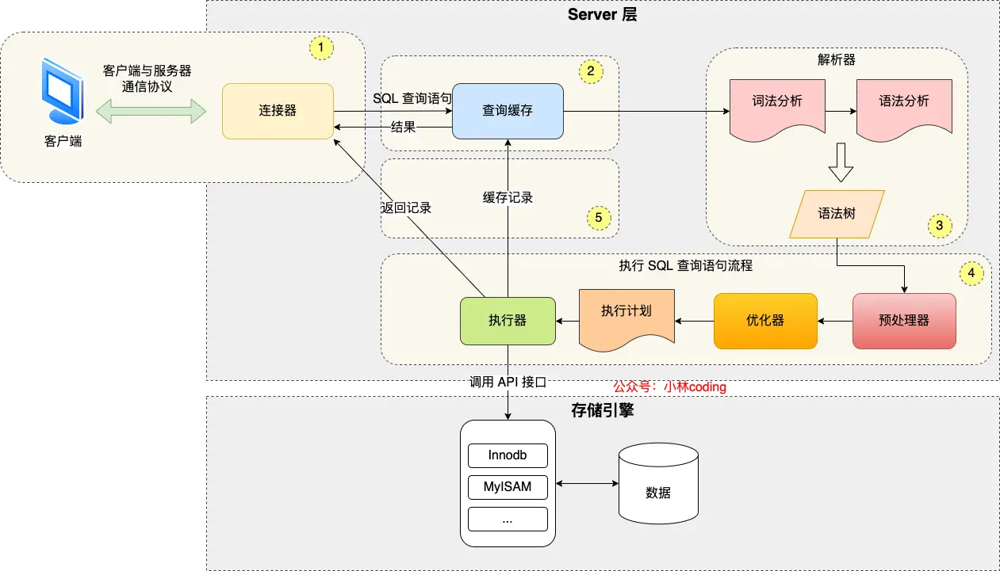
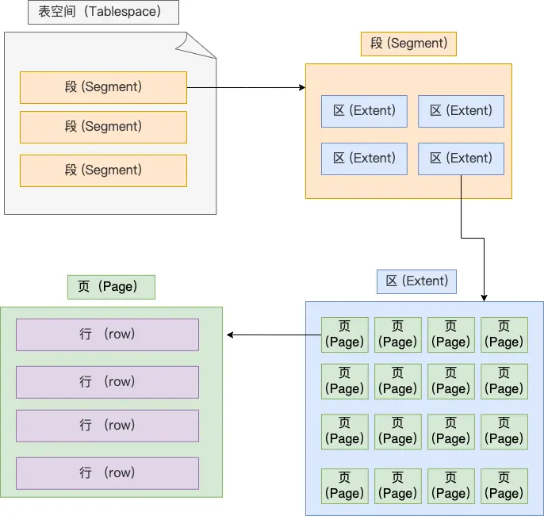
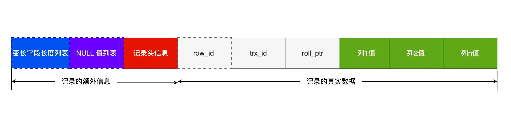
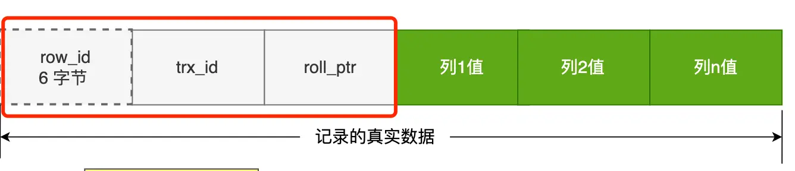
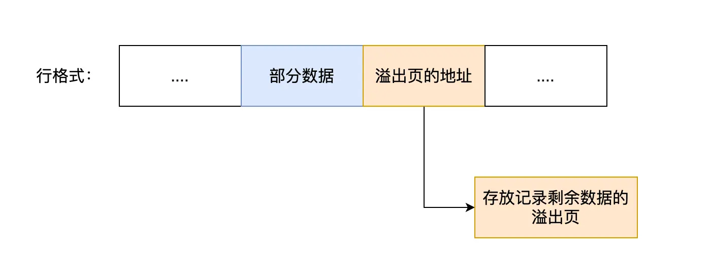
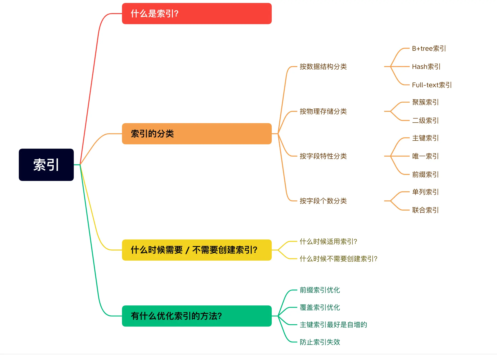
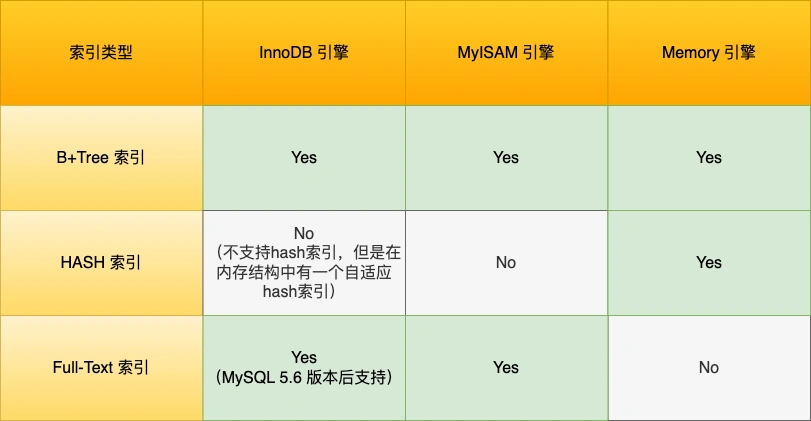
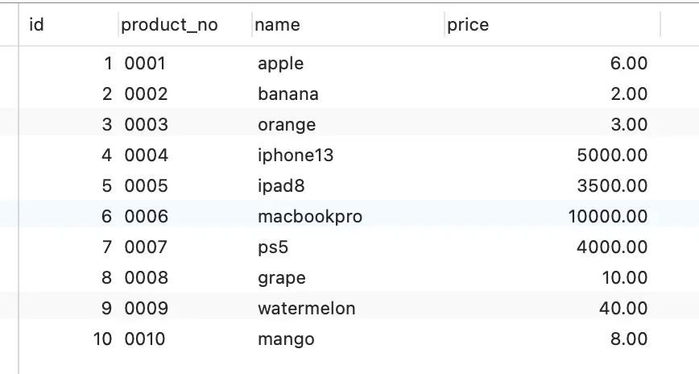
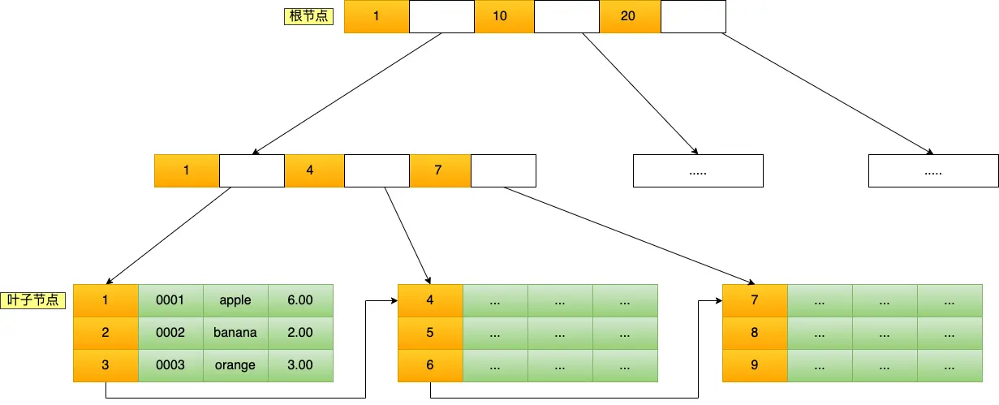
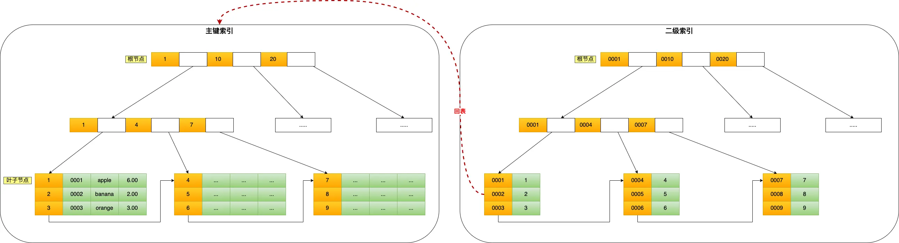

- [基础篇](#基础篇)
  - [执行一条select语句，期间发生了什么？](#执行一条select语句期间发生了什么)
    - [MySQL执行流程是怎样的？](#mysql执行流程是怎样的)
    - [第一步：连接器](#第一步连接器)
    - [第二步：查询缓存](#第二步查询缓存)
    - [第三步：解析SQL](#第三步解析sql)
      - [解析器](#解析器)
    - [第四步：执行SQL](#第四步执行sql)
      - [预处理器](#预处理器)
      - [优化器](#优化器)
      - [执行器](#执行器)
  - [MySQL 一行记录是怎么存储的？](#mysql-一行记录是怎么存储的)
    - [MySQL的数据存放在哪个文件？](#mysql的数据存放在哪个文件)
      - [表空间文件的结构是怎么样的？](#表空间文件的结构是怎么样的)
    - [InnoDB行格式有哪些？](#innodb行格式有哪些)
    - [COMPACT行格式长什么样？](#compact行格式长什么样)
      - [记录的额外信息](#记录的额外信息)
      - [记录的真实数据](#记录的真实数据)
    - [varchar(n)中n最大取值为多少？](#varcharn中n最大取值为多少)
      - [单字段的情况](#单字段的情况)
      - [多字段的情况](#多字段的情况)
    - [行溢出后，MySQL是怎么处理的？](#行溢出后mysql是怎么处理的)
- [索引篇](#索引篇)
  - [索引常见面试题](#索引常见面试题)
    - [什么是索引](#什么是索引)
    - [索引的分类](#索引的分类)
      - [按数据结构分类](#按数据结构分类)
        - [通过主键查询商品数据的过程](#通过主键查询商品数据的过程)
        - [通过耳机索引查询商品数据的过程](#通过耳机索引查询商品数据的过程)
        - [为什么 MySQL InnoDB 选择 B+tree 作为索引的数据结构？](#为什么-mysql-innodb-选择-btree-作为索引的数据结构)
      - [按物理存储分类](#按物理存储分类)
      - [按字段特性分类](#按字段特性分类)

# 基础篇

## 执行一条select语句，期间发生了什么？
~~~sql
// 在 product 表中，查询 id = 1 的记录
select * from product where id = 1;
~~~
### MySQL执行流程是怎样的？
  
MySQL的架构分为两层：Server层和存储引擎层
- __Server 层负责建立连接__、分析和执行 SQL。MySQL 大多数的核心功能模块都在这实现，主要包括连接器，查询缓存、解析器、预处理器、优化器、执行器等。另外，所有的内置函数（如日期、时间、数学和加密函数等）和所有跨存储引擎的功能（如存储过程、触发器、视图等。）都在 Server 层实现。
- __存储引擎层负责数据的存储和提取__。支持 InnoDB、MyISAM、Memory 等多个存储引擎，不同的存储引擎共用一个 Server 层。现在最常用的存储引擎是 InnoDB，从 MySQL 5.5 版本开始， InnoDB 成为了 MySQL 的默认存储引擎。我们常说的索引数据结构，就是由存储引擎层实现的，不同的存储引擎支持的索引类型也不相同，比如 InnoDB 支持索引类型是 B+树 ，且是默认使用，也就是说在数据表中创建的主键索引和二级索引默认使用的是 B+ 树索引。

### 第一步：连接器
连接命令：
~~~sql
# -h 指定 MySQL 服务得 IP 地址，如果是连接本地的 MySQL服务，可以不用这个参数；
# -u 指定用户名，管理员角色名为 root；
# -p 指定密码，如果命令行中不填写密码（为了密码安全，建议不要在命令行写密码），就需要在交互对话里面输入密码
mysql -h$ip -u$user -p
~~~
连接的过程需要先经过 TCP 三次握手，因为 MySQL 是基于 TCP 协议进行传输的  

MySQL 定义了空闲连接的最大空闲时长，由 wait_timeout 参数控制的，默认值是 8 小时（28880秒），如果空闲连接超过了这个时间，连接器就会自动将它断开。

长连接和短连接
~~~
// 短连接
连接 mysql 服务（TCP 三次握手）
执行sql
断开 mysql 服务（TCP 四次挥手）

// 长连接
连接 mysql 服务（TCP 三次握手）
执行sql
执行sql
执行sql
....
断开 mysql 服务（TCP 四次挥手）
~~~
长连接的好处就是可以减少建立连接和断开连接的过程，所以一般是推荐使用长连接。但是占用内存多

解决方式
- 定期断开长连接
- 客户端主动重置连接

总结
- 与客户端进行 TCP 三次握手建立连接；
- 校验客户端的用户名和密码，如果用户名或密码不对，则会报错；
- 如果用户名和密码都对了，会读取该用户的权限，然后后面的权限逻辑判断都基于此时读取到的权限；

### 第二步：查询缓存
连接完成后客户端就可以向MySQL服务器发SQL语句了MySQL 服务收到 SQL 语句后，就会解析出 SQL 语句的第一个字段，看看是什么类型的语句。

如果 SQL 是查询语句（select 语句），MySQL 就会先去查询缓存（ Query Cache ）里查找缓存数据，看看之前有没有执行过这一条命令，这个查询缓存是以 key-value 形式保存在内存中的，key 为 SQL 查询语句，value 为 SQL 语句查询的结果。

如果查询的语句命中查询缓存，那么就会直接返回 value 给客户端。如果查询的语句没有命中查询缓存中，那么就要往下继续执行，等执行完后，查询的结果就会被存入查询缓存中。

查询缓存挺鸡肋的。

对于更新比较频繁的表，查询缓存的命中率很低的，因为只要一个表有更新操作，那么这个表的查询缓存就会被清空。如果刚缓存了一个查询结果很大的数据，还没被使用的时候，刚好这个表有更新操作，查询缓冲就被清空了，相当于缓存了个寂寞。

所以，MySQL 8.0 版本直接将查询缓存删掉了，也就是说 MySQL 8.0 开始，执行一条 SQL 查询语句，不会再走到查询缓存这个阶段了。

### 第三步：解析SQL

#### 解析器
解析器做两件事
- 语法分析  
  根据你输入的字符串识别出关键字出来，构建出 SQL 语法树，这样方便后面模块获取 SQL 类型、表名、字段名、 where 条件等等。
- 语法分析  
  判断你输入的这个 SQL 语句是否满足 MySQL 语法。

### 第四步：执行SQL
- prepare 阶段，也就是预处理阶段；
- optimize 阶段，也就是优化阶段；
- execute 阶段，也就是执行阶段；

#### 预处理器
- 检查SQL查询语句中的表或者字段是否存在
- 将select*中的*符号，扩展为表上的所有列

#### 优化器
__为SQL查询语句先制定一个执行方案__
基于查询成本

#### 执行器
- 主键索引查询
- 全表扫描
- 索引下堆

__主键索引查询__
~~~
select * from product where id = 1;
~~~
这条查询语句的查询条件用到了主键索引，而且是等值查询，同时主键 id 是唯一，不会有 id 相同的记录，所以优化器决定选用访问类型为 const 进行查询，也就是使用主键索引查询一条记录，那么执行器与存储引擎的执行流程是这样的：
- 执行器第一次查询，会调用 read_first_record 函数指针指向的函数，因为优化器选择的访问类型为 const，这个函数指针被指向为 InnoDB 引擎索引查询的接口，把条件 id = 1 交给存储引擎，__让存储引擎定位符合条件的第一条记录__。
- 存储引擎通过主键索引的 B+ 树结构定位到 id = 1的第一条记录，如果记录是不存在的，就会向执行器上报记录找不到的错误，然后查询结束。如果记录是存在的，就会将记录返回给执行器；
- 执行器从存储引擎读到记录后，接着判断记录是否符合查询条件，如果符合则发送给客户端，如果不符合则跳过该记录。
- 执行器查询的过程是一个 while 循环，所以还会再查一次，但是这次因为不是第一次查询了，所以会调用 read_record 函数指针指向的函数，因为优化器选择的访问类型为 const，这个函数指针被指向为一个永远返回 - 1 的函数，所以当调用该函数的时候，执行器就退出循环，也就是结束查询了。

__全表扫描__
~~~sql
select * from product where name = 'iphone';
~~~
这条查询语句的查询条件没有用到索引，所以优化器决定选用访问类型为 ALL 进行查询，也就是全表扫描的方式查询，那么这时执行器与存储引擎的执行流程是这样的：
- 执行器第一次查询，会调用 read_first_record 函数指针指向的函数，因为优化器选择的访问类型为 all，这个函数指针被指向为 InnoDB 引擎全扫描的接口，__让存储引擎读取表中的第一条记录__；
- 执行器会判断读到的这条记录的 name 是不是 iphone，如果不是则跳过；如果是则将记录发给客户的（是的没错，Server 层每从存储引擎读到一条记录就会发送给客户端，之所以客户端显示的时候是直接显示所有记录的，是因为客户端是等查询语句查询完成后，才会显示出所有的记录）。
- 执行器查询的过程是一个 while 循环，所以还会再查一次，会调用 read_record 函数指针指向的函数，因为优化器选择的访问类型为 all，read_record 函数指针指向的还是 InnoDB 引擎全扫描的接口，所以接着向存储引擎层要求继续读刚才那条记录的下一条记录，存储引擎把下一条记录取出后就将其返回给执行器（Server层），执行器继续判断条件，不符合查询条件即跳过该记录，否则发送到客户端；
- 一直重复上述过程，直到存储引擎把表中的所有记录读完，然后向执行器（Server层） 返回了读取完毕的信息；
- 执行器收到存储引擎报告的查询完毕的信息，退出循环，停止查询

__索引下堆__
索引下推能够减少 __二级索引__ 在查询时的回表操作，提高查询的效率，因为它将 Server 层部分负责的事情，交给存储引擎层去处理了。
~~~sql
select * from t_user  where age > 20 and reward = 100000;
~~~

可以看到，没有索引下推的时候，每查询到一条二级索引记录，都要进行回表操作，然后将记录返回给 Server，接着 Server 再判断该记录的 reward 是否等于 100000。

使用索引下推后，判断记录的 reward 是否等于 100000 的工作交给了存储引擎层，过程如下 ：

- Server 层首先调用存储引擎的接口定位到满足查询条件的第一条二级索引记录，也就是定位到 age > 20 的第一条记录；
- 存储引擎定位到二级索引后，__先不执行回表__ 操作，而是先判断一下该索引中包含的列（reward列）的条件（reward 是否等于 100000）是否成立。如果条件不成立，则直接跳过该二级索引。如果成立，则执行回表操作，将完成记录返回给 Server 层。
- Server 层在判断其他的查询条件（本次查询没有其他条件）是否成立，如果成立则将其发送给客户端；否则跳过该记录，然后向存储引擎索要下一条记录。
如此往复，直到存储引擎把表中的所有记录读完。

总结：
执行一条 SQL 查询语句，期间发生了什么？

- 连接器：建立连接，管理连接、校验用户身份；
- 查询缓存：查询语句如果命中查询缓存则直接返回，否则继续往下执行。MySQL 8.0 已删除该模块；
- 解析 SQL，通过解析器对 SQL 查询语句进行词法分析、语法分析，然后构建语法树，方便后续模块读取表名、字段、语句类型；
- 执行 SQL：执行 SQL 共有三个阶段：
    - 预处理阶段：检查表或字段是否存在；将 select * 中的 * 符号扩展为表上的所有列。
    - 优化阶段：基于查询成本的考虑， 选择查询成本最小的执行计划；
    - 执行阶段：根据执行计划执行 SQL 查询语句，从存储引擎读取记录，返回给客户端

## MySQL 一行记录是怎么存储的？
### MySQL的数据存放在哪个文件？
MySQL 存储的行为是由存储引擎实现的，MySQL 支持多种存储引擎，不同的存储引擎保存的文件自然也不同。

InnoDB 是我们常用的存储引擎，也是 MySQL 默认的存储引擎。

 MySQL 数据库的文件存放在哪个目录？
 ~~~sql
mysql> SHOW VARIABLES LIKE 'datadir';
+---------------+-----------------+
| Variable_name | Value           |
+---------------+-----------------+
| datadir       | /var/lib/mysql/ |
+---------------+-----------------+
1 row in set (0.00 sec)
 ~~~
 进入 /var/lib/mysql/my_test 目录，看看里面有什么文件？
 ~~~
[root@xiaolin ~]#ls /var/lib/mysql/my_test
db.opt  
t_order.frm  
t_order.ibd
 ~~~
- db.opt，用来存储当前数据库的默认字符集和字符校验规则。
- t_order.frm ，t_order 的表结构会保存在这个文件。在 MySQL 中建立一张表都会生成一个.frm 文件，该文件是用来保存每个表的元数据信息的，主要包含表结构定义。
- t_order.ibd，t_order 的表数据会保存在这个文件。表数据既可以存在共享表空间文件（文件名：ibdata1）里，也可以存放在独占表空间文件（文件名：表名字.ibd）。这个行为是由参数 innodb_file_per_table 控制的，若设置了参数 innodb_file_per_table 为 1，则会将存储的数据、索引等信息单独存储在一个独占表空间，从 MySQL 5.6.6 版本开始，它的默认值就是 1 了，因此从这个版本之后， MySQL 中每一张表的数据都存放在一个独立的 .ibd 文件。
#### 表空间文件的结构是怎么样的？
__表空间由段（segment）、区（extent）、页（page）、行（row）组成__，InnoDB存储引擎的逻辑存储结构大致如下图：
  

1. 行（row）
2. 页（page）  
__InnoDB 的数据是按「页」为单位来读写的__
__默认每个页的大小为 16KB__
3. 区（extent）
InnoDB 存储引擎是用 B+ 树来组织数据的。
__在表中数据量大的时候，为某个索引分配空间的时候就不再按照页为单位分配了，而是按照区（extent）为单位分配。每个区的大小为 1MB，对于 16KB 的页来说，连续的 64 个页会被划为一个区，这样就使得链表中相邻的页的物理位置也相邻，就能使用顺序 I/O 了__
4. 段（segment）
   段一般分为数据段、索引段和回滚段等。
- 索引段：存放 B + 树的非叶子节点的区的集合；
- 数据段：存放 B + 树的叶子节点的区的集合；
- 回滚段：存放的是回滚数据的区的集合，之前讲事务隔离 (opens new window)的时候就介绍到了 MVCC 利用了回滚段实现了多版本查询数据。

### InnoDB行格式有哪些？
行格式（row_format），就是一条记录的存储结构。
- Redundant 是很古老的行格式了， MySQL 5.0 版本之前用的行格式，现在基本没人用了。
- 由于 Redundant 不是一种紧凑的行格式，所以 MySQL 5.0 之后引入了 Compact 行记录存储方式，Compact 是一种紧凑的行格式，设计的初衷就是为了让一个数据页中可以存放更多的行记录，从 MySQL 5.1 版本之后，行格式默认设置成 Compact。
- Dynamic 和 Compressed 两个都是紧凑的行格式，它们的行格式都和 Compact 差不多，因为都是基于 Compact 改进一点东西。从 MySQL5.7 版本之后，默认使用 Dynamic 行格式。

### COMPACT行格式长什么样？
  

#### 记录的额外信息
1. 变长字段长度列表
   逆序存放：使得位置靠前的记录的真实数据和数据对应的字段长度信息可以同时在一个 CPU Cache Line 中，这样就可以提高 CPU Cache 的命中率。

   当数据表没有变长字段的时候，比如全部都是 int 类型的字段，这时候表里的行格式就不会有「变长字段长度列表」
2. NULL值列表
    逆序排放
    当数据表的字段都定义成 NOT NULL 的时候，这时候表里的行格式就不会有 NULL 值列表了。
3. 记录头信息  
    几条比较重要的  
- delete_mask ：标识此条数据是否被删除。从这里可以知道，我们执行 detele 删除记录的时候，并不会真正的删除记录，只是将这个记录的 delete_mask 标记为 1。
- next_record：下一条记录的位置。从这里可以知道，记录与记录之间是通过链表组织的。在前面我也提到了，指向的是下一条记录的「记录头信息」和「真实数据」之间的位置，这样的好处是向左读就是记录头信息，向右读就是真实数据，比较方便。
- record_type：表示当前记录的类型，0表示普通记录，1表示B+树非叶子节点记录，2表示最小记录，3表示最大记录

#### 记录的真实数据
  
- row_id  
  如果我们建表的时候指定了主键或者唯一约束列，那么就没有 row_id 隐藏字段了。如果既没有指定主键，又没有唯一约束，那么 InnoDB 就会为记录添加 row_id 隐藏字段。row_id不是必需的，占用 6 个字节。
- trx_id  
事务id，表示这个数据是由哪个事务生成的。 trx_id是必需的，占用 6 个字节。
- roll_pointer  
这条记录上一个版本的指针。roll_pointer 是必需的，占用 7 个字节。
   
### varchar(n)中n最大取值为多少？
__MySQL 规定除了 TEXT、BLOBs 这种大对象类型之外，其他所有的列（不包括隐藏列和记录头信息）占用的字节长度加起来不能超过 65535 个字节。__

varchar(n) 字段类型的 n 代表的是最多存储的字符数量

要算 varchar(n) 最大能允许存储的字节数，还要看数据库表的字符集，因为字符集代表着，1个字符要占用多少字节，比如 ascii 字符集， 1 个字符占用 1 字节，那么 varchar(100) 意味着最大能允许存储 100 字节的数据。

#### 单字段的情况

一行记录最大只能存储 65535 字节的数据。

那假设数据库表只有一个 varchar(n) 类型的列且字符集是 ascii，在这种情况下， varchar(n) 中 n 最大取值是 65535 吗？ 不能

__一行数据的最大字节数是 65535（不包含 TEXT、BLOBs 这种大对象类型），其中包含了 storage overhead。__

存储字段类型为 varchar(n) 的数据时，其实分成了三个部分来存储：
- 真实数据
- 真实数据占用的字节数
- NULL标识

定义一个 varchar(65535) 类型的字段，字符集为 ascii 的数据库表

不行

 1 字节来表示「NULL 值列表」，「变长字段长度列表」= 1 个「变长字段长度」占用的字节数，也就是 2 字节。  
 在数据库表只有一个 varchar(n) 字段且字符集是 ascii 的情况下，varchar(n) 中 n 最大值 = 65535 - 2 - 1 = 65532。 对

 - 在 UTF-8 字符集下，一个字符最多需要三个字节，varchar(n) 的 n 最大取值就是 65532/3 = 21844。

#### 多字段的情况
__如果有多个字段的话，要保证所有字段的长度 + 变长字段字节数列表所占用的字节数 + NULL值列表所占用的字节数 <= 65535__

### 行溢出后，MySQL是怎么处理的？
MySQL 中磁盘和内存交互的基本单位是页，一个页的大小一般是 16KB，也就是 16384字节，而一个 varchar(n) 类型的列最多可以存储 65532字节，一些大对象如 TEXT、BLOB 可能存储更多的数据，这时一个页可能就存不了一条记录。这个时候就会 __发生行溢出，多的数据就会存到另外的「溢出页」中。__

当发生行溢出时，在记录的真实数据处只会保存该列的一部分数据，而把剩余的数据放在「溢出页」中，然后真实数据处用 20 字节存储指向溢出页的地址，从而可以找到剩余数据所在的页。大致如下图所示。
  

# 索引篇
  
## 索引常见面试题

### 什么是索引
书中的目录就是充当索引的角色，索引是数据的目录

### 索引的分类
- 按「数据结构」分类：B+tree索引、Hash索引、Full-text索引。
- 按「物理存储」分类：聚簇索引（主键索引）、二级索引（辅助索引）。
- 按「字段特性」分类：主键索引、唯一索引、普通索引、前缀索引。
- 按「字段个数」分类：单列索引、联合索引

#### 按数据结构分类
  
创建表时，InnoDB 存储引擎会根据不同的场景选择不同的列作为索引：

- 如果有主键，默认会使用主键作为聚簇索引的索引键（key）；
- 如果没有主键，就选择第一个不包含 NULL 值的唯一列作为聚簇索引的索引键（key）；
- 在上面两个都没有的情况下，InnoDB 将自动生成一个隐式自增 id 列作为聚簇索引的索引键（key）
  
其它索引都属于辅助索引（Secondary Index），也被称为二级索引或非聚簇索引。创建的主键索引和二级索引默认使用的是 B+Tree 索引。

举例说明B+Tree索引在存储数据中的具体实现

创建一张商品表，id 为主键，如下：
~~~sql
CREATE TABLE `product`  (
  `id` int(11) NOT NULL,
  `product_no` varchar(20)  DEFAULT NULL,
  `name` varchar(255) DEFAULT NULL,
  `price` decimal(10, 2) DEFAULT NULL,
  PRIMARY KEY (`id`) USING BTREE
) CHARACTER SET = utf8 COLLATE = utf8_general_ci ROW_FORMAT = Dynamic;
~~~
表内数据：
  
B+Tree 是一种多叉树，叶子节点才存放数据，非叶子节点只存放索引，而且每个节点里的数据是按 __主键顺序__ 存放的。每一层父节点的索引值都会出现在下层子节点的索引值中，因此在叶子节点中，包括了所有的索引值信息，并且每一个叶子节点都有两个指针，分别指向下一个叶子节点和上一个叶子节点，形成一个 __双向链表__。下图是单向，其实是双向
  

##### 通过主键查询商品数据的过程
~~~sql
select * from product where id= 5;
~~~
这条语句使用了主键索引查询 id 号为 5 的商品。查询过程是这样的，B+Tree 会自顶向下逐层进行查找：
- 将 5 与根节点的索引数据 (1，10，20) 比较，5 在 1 和 10 之间，所以根据 B+Tree的搜索逻辑，找到第二层的索引数据 (1，4，7)；
- 在第二层的索引数据 (1，4，7)中进行查找，因为 5 在 4 和 7 之间，所以找到第三层的索引数据（4，5，6）；
- 在叶子节点的索引数据（4，5，6）中进行查找，然后我们找到了索引值为 5 的行数据。

数据库的索引和数据都是存储在硬盘的，我们可以把读取一个节点当作一次磁盘 I/O 操作。那么上面的整个查询过程一共经历了 3 个节点，也就是进行了 3 次 I/O 操作。

B+Tree 存储千万级的数据只需要 3-4 层高度就可以满足，这意味着从千万级的表查询目标数据最多需要 3-4 次磁盘 I/O，__所以B+Tree 相比于 B 树和二叉树来说，最大的优势在于查询效率很高，因为即使在数据量很大的情况，查询一个数据的磁盘 I/O 依然维持在 3-4次。__

##### 通过耳机索引查询商品数据的过程
主键索引的 B+Tree 和二级索引的 B+Tree 区别如下：
- 主键索引的 B+Tree 的叶子节点存放的是实际数据，所有完整的用户记录都存放在主键索引的 B+Tree 的叶子节点里；
- 二级索引的 B+Tree 的叶子节点存放的是主键值，而不是实际数据。
~~~
select * from product where product_no = '0002';
~~~
会先检二级索引中的 B+Tree 的索引值（商品编码，product_no），找到对应的叶子节点，然后获取主键值，然后再通过主键索引中的 B+Tree 树查询到对应的叶子节点，然后获取整行数据。这个过程叫「回表」，也就是说要查两个 B+Tree 才能查到数据。
  
当查询的数据是能在二级索引的 B+Tree 的叶子节点里查询到，这时就不用再查主键索引查，比如下面这条查询语句：
~~~
select id from product where product_no = '0002';
~~~
__这种在二级索引的 B+Tree 就能查询到结果的过程就叫作「覆盖索引」，也就是只需要查一个 B+Tree 就能找到数据。__

##### 为什么 MySQL InnoDB 选择 B+tree 作为索引的数据结构？
1、___B+Tree vs B Tree___  

B+Tree 只在叶子节点存储数据，而 B 树 的非叶子节点也要存储数据，所以 B+Tree 的单个节点的数据量更小，在相同的磁盘 I/O 次数下，就能查询更多的节点。

另外，B+Tree 叶子节点采用的是双链表连接，适合 MySQL 中常见的基于范围的顺序查找，而 B 树无法做到这一点。

2、___B+Tree vs 二叉树___

对于有 N 个叶子节点的 B+Tree，其搜索复杂度为O(logdN)，其中 d 表示节点允许的最大子节点个数为 d 个。

在实际的应用当中， d 值是大于100的，这样就保证了，即使数据达到千万级别时，B+Tree 的高度依然维持在 3~4 层左右，也就是说一次数据查询操作只需要做 3~4 次的磁盘 I/O 操作就能查询到目标数据。

而二叉树的每个父节点的儿子节点个数只能是 2 个，意味着其搜索复杂度为 O(logN)，这已经比 B+Tree 高出不少，因此二叉树检索到目标数据所经历的磁盘 I/O 次数要更多。

3、___B+Tree vs Hash___

Hash 在做等值查询的时候效率贼快，搜索复杂度为 O(1)。

但是 Hash 表不适合做范围查询，它更适合做等值的查询，这也是 B+Tree 索引要比 Hash 表索引有着更广泛的适用场景的原因

#### 按物理存储分类
物理存储的角度来看，索引分为聚簇索引（主键索引）、二级索引（辅助索引）。
- 主键索引的 B+Tree 的叶子节点存放的是实际数据，所有完整的用户记录都存放在主键索引的 B+Tree 的叶子节点里；
- 二级索引的 B+Tree 的叶子节点存放的是主键值，而不是实际数据。

#### 按字段特性分类
从字段特性的角度来看，索引分为主键索引、唯一索引、普通索引、前缀索引。