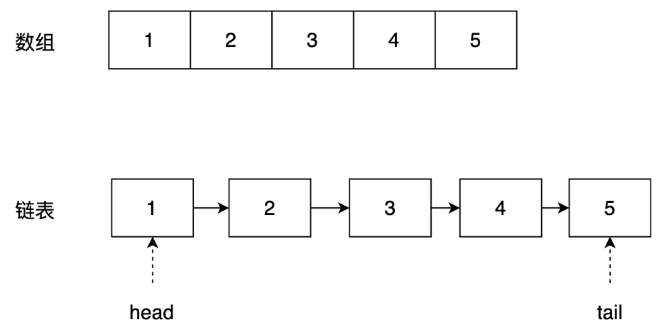
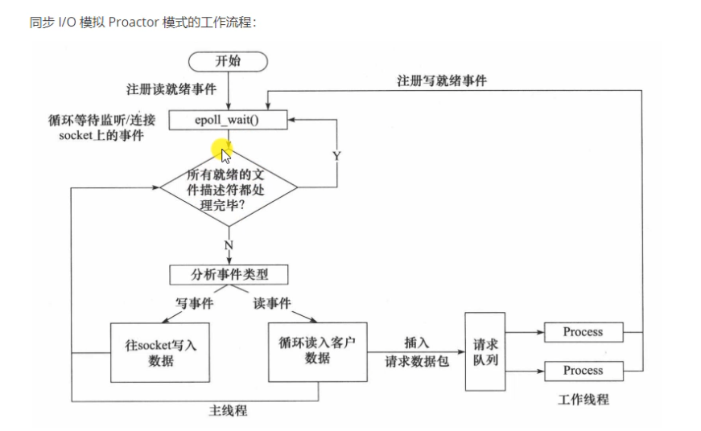

- [C++](#c)
  - [1.下面说法正确的是（）](#1下面说法正确的是)
  - [2.以下关于面向对象的描述错误的是：](#2以下关于面向对象的描述错误的是)
  - [3.调用一成员函数时, 使用动态联编的情况是？](#3调用一成员函数时-使用动态联编的情况是)
  - [5.多选题 下面程序段的运行结果是（ ）](#5多选题-下面程序段的运行结果是-)
  - [7.在32位系统中，下面代码打印结果为（）](#7在32位系统中下面代码打印结果为)
  - [8.下面程序的输出结果是（）](#8下面程序的输出结果是)
  - [9.执行下列程序后，其输出结果是（ ）](#9执行下列程序后其输出结果是-)
  - [10.参加位运算的数据其类型不能是（）。](#10参加位运算的数据其类型不能是)
  - [11.以下哪项描述是正确的](#11以下哪项描述是正确的)
- [计算机基础](#计算机基础)
- [数据结构与算法](#数据结构与算法)
  - [6.数组和链表的区别、适用场景](#6数组和链表的区别适用场景)
  - [12.完成路径选择功能是在 OSI 模型的 ()](#12完成路径选择功能是在-osi-模型的-)
  - [16.在 OSI 七层模型中，网络层的主要功能是](#16在-osi-七层模型中网络层的主要功能是)
  - [17.下列关于IP路由器功能的描述中，正确的是（）。](#17下列关于ip路由器功能的描述中正确的是)
  - [13.下列设备不属于通信设备的是（        ）](#13下列设备不属于通信设备的是--------)
  - [14.公司办公室有一台交换机,具有12个10/100Mbps端口和4个1000Mbps端口，100M端口使用半双工传输模式，1000M端口使用全双工传输模式,交换机总带宽应为（ ）](#14公司办公室有一台交换机具有12个10100mbps端口和4个1000mbps端口100m端口使用半双工传输模式1000m端口使用全双工传输模式交换机总带宽应为-)
  - [15.网卡的主要功能不包括（）。](#15网卡的主要功能不包括)

## C++
### 1.下面说法正确的是（）
A. 在C++语言中new和malloc都是在堆（heap）上进行动态的内存操作，可以互相代替。  
B. C++语言重载（over load）是指子类重新定义父类的虚函数的方法。  
C. C++语言函数既可以嵌套定义又可以递归调用。  
D. 在C++语言中调用函数时，只能把实参的值传给形参，形参的值不能传送给实参（不考虑引用、指针等情况）。  

  
点击显示答案

  答案：D   

  A，关键字new和malloc都是在堆（heap）上进行动态的内存申请，但是内存释放不同，new申请的内存用delete释放，malloc申请的内存用free释放，因此不能代替 B，子类重新定义父类的虚函数的方法 这种叫覆盖，override C，函数不能嵌套定义，也就是函数内部不能定义函数

### 2.以下关于面向对象的描述错误的是：
A
面向对象的基本特性是封装，继承和多态  
B
构造函数不可以是虚函数，析构函数可以是虚函数  
C
子类重新定义父类虚函数的方法叫做重载  
D
多态是为了接口重用，封装和继承是为了代码重用  

  
点击显示答案

正确答案：C

参考答案：答案 C 子类重新定义父类虚函数的方法叫做 __覆写__

### 3.调用一成员函数时, 使用动态联编的情况是？
A
通过对象调用一虚函数  
B
通过指针或引用调用一虚函数  
C
通过对象调用静态函数  
D
通过指针或应用调用一静态函数  

  
点击显示答案

正确答案：B

动态联编(动态绑定)就是程序在运行的时候知道该调用哪个函数，而不是编译阶段，所以这个机制应该是由虚函数支持的，即运行时的多态，基类的某个成员函数声明为虚函数，派生类继承，而且同样重写该函数，那么当声明一个派生类的指针或者引用时，它所调用的函数是由该指针指向的对象确定的，这就是动态联编   

### 5.多选题 下面程序段的运行结果是（ ）
~~~c++
char s[] = "12345", *p = s;
printf("%d\n", *(p+5));
~~~

  
点击显示答案

正确答案：AB 

 字符’\0’的ASCII码值就是0

### 7.在32位系统中，下面代码打印结果为（）
~~~c++
class Base {
char data[3];
public:
    virtual void f() { cout << "Base::f" << endl; }
    virtual void g() { cout << "Base::g" << endl; }
    virtual void h() { cout << "Base::h" << endl; }
};
int main() {
    cout << sizeof(Base)<< endl;
    return 0;
}
~~~

  
点击显示答案

答案：8  
data[3]占3个字节，因后面有虚函数，应开辟空间存放虚函数指针，虚函数指针占4个字节，data中剩余的一个字节不够，重新开辟4字节并且data中空出一个 __字节对齐__ ，因此sizeof(Base) = (3 * sizeof(char) + 1(空余一个字节，进行对齐))+ 4(虚函数指针）

### 8.下面程序的输出结果是（）
~~~c++
#include <iostream>
using namespace std;
 
class Base {
public:
    virtual void f() {
        cout << "f0+";
    }
    void g() {
        cout << "g0+";
    }
};
class Derived : public Base {
public:
    void f() {
        cout << "f+";
    }
    void g() {
        cout << "g+";
    }
};
 
int main() {
    Derived d;
    Base* p = &d;
    p->f();
    p->g();
    return 0;
}
~~~

  
点击显示答案

  f+：因为基类中f()为虚函数，通过基类指针执行的是多态操作，调用的是子类的f()函数； 
 
  g0+：基类中g()不是虚函数，因此不是多态操作，执行的是基类的g()函数

### 9.执行下列程序后，其输出结果是（ ）
~~~c++
int main() {
    int a = 9;
    a += a -= a + a;
    printf("%d\n", a);
    return 0;
}
~~~

  
点击显示答案

从右往左运算 -18

### 10.参加位运算的数据其类型不能是（）。
A int  
B char  
C float  
D  long int  

  
点击显示答案

无论是float  还是double,在内存中的存储分为三部分：符号位，指数位，尾数位；位运算符对它们没有意义   

### 11.以下哪项描述是正确的

A
父类的构造函数与析构函数不会自动被调用  
B
成员变量需要用public protected private修饰，在定义变量时不再需要var关键字  
C
父类中定义的静态成员，不可以在子类中直接调用   
D
包含抽象方法的类必须为抽象类，抽象类不能被实例化  

  
点击显示答案

BD  

## 计算机基础

## 数据结构与算法

### 6.数组和链表的区别、适用场景
  

  
点击显示答案

||`数组`|`链表`|
|--|--|--|
|存储方式|连续的内存块|非连续的内存块|
|插入操作|需要移动后续元素，时间复杂度 O(N)|只需要修改前后节点的指针即可，时间复杂度 O(1)|
|删除操作|需要移动后续元素，时间复杂度 O(N)|只需要修改前后节点的指针即可，时间复杂度 O(1)|
|随机访问|支持，查找时间复杂度 O(1)|不支持，查找时间复杂度 O(N)|
|内存占用	|	固定，需要预分配空间|动态，只需要使用时申请空间|
|适用场景|数据大小固定，随机访问多|数据大小不固定，插入、删除操作频繁的场景|

##网络

### 12.完成路径选择功能是在 OSI 模型的 ()
A
物理层
B
数据链路层
C
网络层
D
运输层

  
点击显示答案

路由器在网络层

### 16.在 OSI 七层模型中，网络层的主要功能是
A
在信道上传输原始的比特流  
B
确保到达对方的各段信息正确无误  
C
确定数据包从源到目的如何选择路由  
D
加强物理层数据传输原始比特流的功能并进行流量控制  

  
点击显示答案

  C
网络层的功能就是网络层设备路由器的功能 

### 17.下列关于IP路由器功能的描述中，正确的是（）。
Ⅰ．运行路由协议，设置路由表

Ⅱ．监测到拥塞时，合理丢弃IP分组

Ⅲ．对收到的IP分组头进行差错校验，确保传输的IP分组不丢失

Ⅳ．根据收到的IP分组的目的IP地址，将其转发到合适的输出线路上

  
点击显示答案

  C
路由器只能保证发送出去的是正确无误的，不能保证接受到的是正确无误的   
网络层对于数据是尽力交付，不保证数据的可靠性，可靠性保证由运输层来完成

### 13.下列设备不属于通信设备的是（        ）
A
路由器
B
交换机
C
打印机
D
集线器

  
点击显示答案

常见通信设备有：中继器、网桥、集线器、交换机、路由器、路由交换机。  

### 14.公司办公室有一台交换机,具有12个10/100Mbps端口和4个1000Mbps端口，100M端口使用半双工传输模式，1000M端口使用全双工传输模式,交换机总带宽应为（ ）
A
0.92G
B
1.6G
C
2.0G
D
9.2G

  
点击显示答案

12个10/100Mbps端口 半双工  1.2G     4个1000Mbps端口  全双工   4G*2=8G     一共 9.2G  

### 15.网卡的主要功能不包括（）。
A 将计算机连接到通信介质上  
B
进行电信号匹配  
C
实现数据传输  
D
网络互连  

  
点击显示答案

网卡是工作在链路层的网络组件，是局域网中连接计算机和传输介质的接口，不仅能实现与局域网传输介质之间的物理连接和电信号匹配，还涉及帧的发送与接收、帧的封装与拆封、介质访问控制、数据的编码与解码以及数据缓存的功能等  
所以网络互联的任务是网线的而不是网卡的

桥接在数据链路层

ARP是地址解析协议，将IP地址转换为对应的mac地址

RARP逆地址解析协议，与ARP相反，将MAC地址转换为IP地址

  

采用了同步I/O模拟Proactor模式，使用线程池 + socket + epoll并发处理事件，使用状态机解析HTTP请求报文，实现了解析GET和POST请求