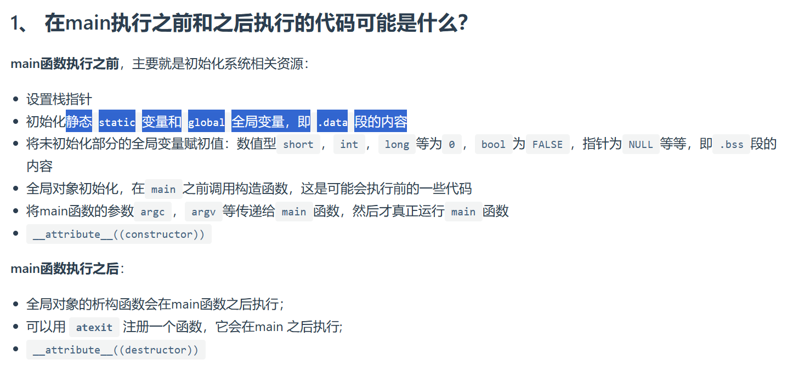

# 1.在main执行之前和之后的代码可能是什么
  
V 

## 1. 栈指针是什么？
在C++中，_栈指针_ 通常由编译器和操作系统负责设置和管理。在程序启动时，操作系统会为程序分配一片栈空间，并初始化栈指针指向栈底的位置。然后，当main函数开始执行时，栈指针会根据函数调用和局部变量的需要动态地进行调整，以便为函数分配栈空间。
## 2.静态(static)变量、全局(global)变量和.data段的概念
    全局变量（global variable）：
    全局变量是在函数外部声明的变量，可以在程序的任何地方访问。全局变量在程序启动时被创建，在程序结束时销毁。全局变量存储在静态数据区(.data段)中。这意味着，全局变量在内存中分配固定的空间，并且在整个程序执行期间保持不变。全局变量具有全局作用域，可以被程序中的所有函数访问。

    静态变量（static variable）：
    静态变量是在函数内部或类的成员变量前加上static关键字声明的变量。对于函数内部的静态变量，它们在程序运行时被创建，但只会在第一次进入声明它们的函数时进行初始化，并在整个程序执行期间保持其值不变。静态变量存储在静态数据区(.data段)或者静态存储区(.bss段)中，具体取决于是否进行了初始化。对于类的静态成员变量，它们在整个类的所有实例之间共享，并且也在静态数据区中存储。

    .data段：
    .data段是程序的一部分，用于存储已经初始化的全局变量和静态变量的数据。这些变量在程序启动时分配内存，并在整个程序执行期间保持不变。.data段在可执行文件镜像中有一个固定的位置，它通常位于静态存储区域。

    总结：
    全局变量和静态变量都存储在.data段中。全局变量具有全局作用域，在整个程序中可见，而静态变量可以具有函数作用域或类作用域，在其作用域内可见。全局变量和静态变量的生命周期是整个程序的执行期间，它们一旦被初始化，就会一直存在于内存中。
## 3. .bss段是什么
在C++中，.bss段（Block Started by Symbol）是可执行文件的一部分，用于存储未初始化的全局变量和静态变量的数据。这些变量在程序启动时被分配空间，但在编译时并没有为它们分配具体的初始值。

.bss段实际上只是一个占位符，它告诉系统为这些变量预留内存空间，但不为它们设置初始值。这样可以节省可执行文件的大小，因为不需要存储冗余的初始值数据。在程序加载到内存时，操作系统会自动将.bss段的内存区域清零，以确保其中的变量都具有默认值0。

以下是一些关于.bss段的特点和内容：

存储未初始化的全局变量和静态变量：.bss段用于存储那些在程序中声明但未显式初始化的全局变量和静态变量。这些变量通过在函数或类外部声明，并且未赋予初始值来定义。

占位符：.bss段实际上只是一个占位符，告诉系统在加载程序时分配空间，但不会存储具体的初始值。

零初始化：在程序加载到内存时，操作系统会自动将.bss段的内存区域清零，使其中的变量都具有默认值0（对于数值类型）或空指针（对于指针类型）。

节省可执行文件大小：由于.bss段不存储具体的初始值数据，因此可以减小可执行文件的大小。

总之，.bss段用于存储未初始化的全局变量和静态变量的数据。它是一个占位符，告诉系统为这些变量预留内存空间，并在加载程序时自动清零，以确保这些变量具有默认值。

## 4.__attribute__((constructor)) 这是什么意思
在C++中，__attribute__((constructor))是一种GCC编译器的特性，用于指示函数在程序启动时自动执行。当将该属性应用于函数时，该函数将被称为构造函数（constructor），并在程序启动时自动调用。

具体而言，__attribute__((constructor))修饰符可用于定义一个函数，并指定该函数在程序启动时自动执行。这对于执行一些初始化操作非常有用，例如设置全局变量、初始化库或执行其他必要的启动任务。

下面是一个示例，展示了如何使用__attribute__((constructor))：
~~~c++
#include <iostream>

void myConstructor() __attribute__((constructor));

void myConstructor() {
    std::cout << "Constructor called!" << std::endl;
}

int main() {
    std::cout << "Main function" << std::endl;

    return 0;
}
~~~
在上述示例中，myConstructor函数被标记为构造函数，因此它会在程序启动时自动调用。该函数将输出"Constructor called!"，然后执行其他操作。

需要注意的是，__attribute__((constructor))是GCC编译器的扩展，因此在使用其他编译器时可能不具备跨平台兼容性。如果需要实现跨平台的构造函数功能，可以考虑使用与编译器无关的替代方法，如在主函数中手动调用初始化函数。

总之，__attribute__((constructor))是一种GCC编译器特性，用于指示函数在程序启动时自动执行。标记为构造函数的函数将在程序启动时调用，并可用于执行初始化操作等任务。