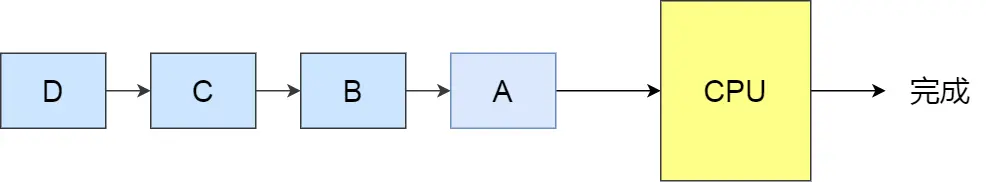
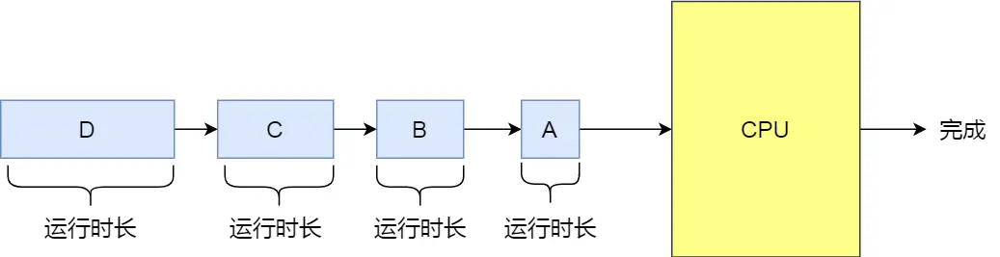
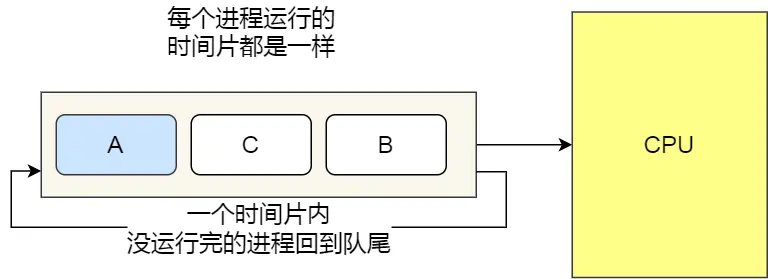
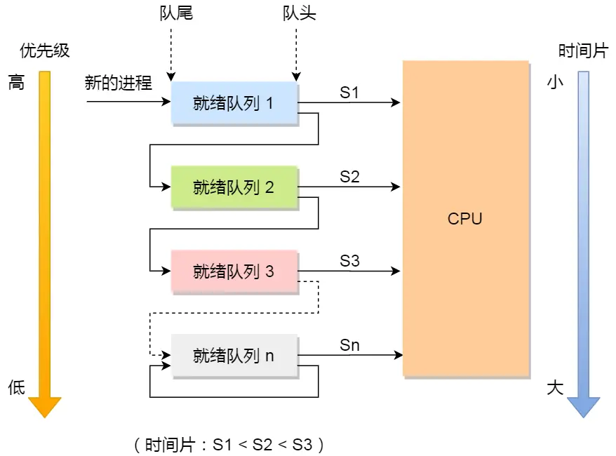

# 进程管理

## 1.进程与线程区别
- 一个进程可以包含多个线程
- 进程间不共享资源，有独立代码和数据空间（程序上下文），由系统直接分发，__开销大__ ,统一进程的不同线程共享空间，线程只独立拥有 __程序计数器、寄存器、堆栈、状态__

- 1.__拥有资源__:进程是资源分配的基本单元，线程是cpu分配和调度的基本单元  
  进程在执行过程中拥有独立的内存单元，而多个线程共享进程的内存。（资源分配给进程，同一进程的所有线程共享该进程的所有资源。同一进程中的多个线程共享代码段（代码和常量），数据段（全局变量和静态变量），扩展段（堆存储）。但是每个线程拥有自己的栈段，栈段又叫运行时段，用来存放所有局部变量和临时变量。
- 2.__调度__：线程是实现独立调度的基本单位。在同一进程中，线程的切换不会引起进程切换，从一个进程中的线程切换到另一个进程中的线程时，会引起进程切换。
- 3.__系统开销__：由于创建和撤销进程时，系统都要位置分配或回收资源，如内存空间、I/O设备等，所付出的开销远大于创建或撤销线程时的开销。类似的，在进行进程切换时，涉及当前执行进程CPU环境的保存及新调度进程CPU环境的设置，而线程切换时之所需保存和设置少量寄存器内容，开销很小
-  4.__通信__：线程间可以通过直接读写同一进程中的数据进行通信，但是进程通信需要借助IPC

## 2.讲讲自旋锁、递归锁、乐观锁、悲观锁、公平锁、非公平锁
- 自旋锁：spinlock，在任何时刻同样只能有一个线程访问对象，但是当获取锁操作失败时，不会进入睡眠，而是会在原地自旋，直到锁被释放。这样节省了线程从睡眠状态到被唤醒期间的消耗，在加锁时间短暂的环境下会极大的提高效率。但如果加锁时间过长，则会非常浪费CPU资源。

## 3.进程间的通信方式
进程通信的方式主要有6种：管道，信号量，消息队列，信号，共享内存，套接字
- 管道
  - 管道是半双工的（单向）双方需要通信的时候，需要建立两个管道。管道的实质是一个内核缓冲区，进程以先进先出的方式从缓冲区存取数据：管道一端的进程顺序地将进程数据写入缓冲区，另一端的进程则顺序地读取数据，该缓冲区可以看做一个循环队列，读和写的位置都是自动增加的，一个数据只能被读一次，读出以后再缓冲区都不复存在了。当缓冲区读空或者写满时，有一定的规则控制相应的读进程或写进程是否进入等待队列，当空的缓冲区有新数据写入或慢的缓冲区有数据读出时，就唤醒等待队列中的进程继续读写。管道是最容易实现的

  - 名管道pipe和命名管道除了建立，打开，删除的方式不同外，其余都是一样的。匿名管道只允许有亲缘关系的进程之间通信，也就是父子进程之间的通信，命名管道允许具有非亲缘关系的进程间通信。

- 信号量
  - 信号量是一个 __计数器__，可以用来控制多个进程对共享资源的访问，信号量只有等待和发送两种操作。等待（P(sv)）就是将其值减一或者挂起进程，发送（V(sv)）就是将其值加一，或者将进程恢复运行

- 信号
  - 信号是Linux系统中用于进程之间通信或操作的一种机制，信号可以在任何时候发送给某一进程，而无须知道该进程的状态，如果该进程并未处于执行状态，则该信号就由内核保存起来，直到该进程恢复执行并传递给他为止，果一个信号被进程设置为阻塞，则该信号的传递被延迟，直到其阻塞被取消时才被传递给进程。 信号是 __开销最小__ 的。

- 共享内存
  - 共享内存允许两个或多个进程共享一个给定的存储区，这一段存储区可以被两个或两个以上的进程映射至自身的地址空间中，就像由malloc()分配的内存一样使用。一个进程写入共享内存的信息，可以被其他使用这个共享内存的进程，通过一个简单的内存读取读出，从而实现了进程间的通信。共享内存的 __效率最高__，__缺点__ 是没有提供同步机制，需要使用锁等其他机制进行同步。

- 消息队列
  - 消息队列就是一个消息的链表，是一系列保存在内核中消息的列表。用户进程可以向消息队列添加消息，也可以向消息队列读取消息
  - 消息队列与管道通信相比，其优势是对每个消息指定特定的消息类型，接收的时候不需要按照队列次序，而是可以根据自定义条件接收特定类型的消息
  - 可以把消息看做一个记录，具有特定的格式以及特定的优先级。对消息队列有写权限的进程可以向消息队列中按照一定的规则添加新消息面对消息队列有读权限的进程可以从消息队列中读取消息
  - 可以在不同的进程之间特工全双工的通信连接

- 套接字
  - 其特点在于可用于不同机器之间的进程通信。

## 4. 进程调度算法
进程调度算法也称 CPU 调度算法，毕竟进程是由 CPU 调度的。

当 CPU 空闲时，操作系统就选择内存中的某个「就绪状态」的进程，并给其分配 CPU。

什么时候会发生 CPU 调度呢？通常有以下情况：

1. 当进程从运行状态转到等待状态；
2. 当进程从运行状态转到就绪状态；
3. 当进程从等待状态转到就绪状态；
4. 当进程从运行状态转到终止状态；

其中发生在 1 和 4 两种情况下的调度称为「非抢占式调度」，2 和 3 两种情况下发生的调度称为「抢占式调度」。

- 非抢占式调度算法挑选一个进程，然后让该进程运行直到被阻塞，或者直到该进程退出，才会调用另外一个进程，也就是说不会理时钟中断这个事情。
- 抢占式调度算法挑选一个进程，然后让该进程只运行某段时间，如果在该时段结束时，该进程仍然在运行时，则会把它挂起，接着调度程序从就绪队列挑选另外一个进程。这种抢占式调度处理，需要在时间间隔的末端发生时钟中断，以便把 CPU 控制返回给调度程序进行调度，也就是常说的时间片机制。

调度算法影响的是等待时间（进程在就绪队列中等待调度的时间总和），而不能影响进程真在使用 CPU 的时间和 I/O 时间。

常见的调度算法：
- 先来先服务调度算法
- 最短作业优先调度算法
- 高响应比优先调度算法
- 时间片轮转调度算法
- 最高优先级调度算法
- 多级反馈队列调度算法
- 
### 先来先服务调度算法（First Come First Severd, FCFS）
  

__每次从就绪队列选择最先进入队列的进程，然后一直运行，直到进程退出或被阻塞，才会继续从队列中选择第一个进程接着运行。__

这似乎很公平，但是当一个长作业先运行了，那么后面的短作业等待的时间就会很长，不利于短作业。

FCFS 对长作业有利，适用于 CPU 繁忙型作业的系统，而不适用于 I/O 繁忙型作业的系统。

### 最短作业优先调度算法（Shortest Job First, SJF）
__优先选择运行时间最短的进程来运行，这有助于提高系统的吞吐量。__

  

对长作业不利，很容易造成一种极端现象。

比如，一个长作业在就绪队列等待运行，而这个就绪队列有非常多的短作业，那么就会使得长作业不断的往后推，周转时间变长，致使长作业长期不会被运行。

### 高响应比优先调度算法（（Highest Response Ratio Next, HRRN）
权衡了短作业和长作业。

每次进行进程调度时，先计算「响应比优先级」，然后把「响应比优先级」最高的进程投入运行

  

- 如果两个进程的「等待时间」相同时，「要求的服务时间」越短，「响应比」就越高，这样短作业的进程容易被选中运行；
- 如果两个进程「要求的服务时间」相同时，「等待时间」越长，「响应比」就越高，这就兼顾到了长作业进程，因为进程的响应比可以随时间等待的增加而提高，当其等待时间足够长时，其响应比便可以升到很高，从而获得运行的机会

### 时间片轮转调度算法（Round Robin, RR） 、

__每个进程被分配一个时间段，称为时间片（Quantum），即允许该进程在该时间段中运行。__

- 如果时间片用完，进程还在运行，那么将会把此进程从 CPU 释放出来，并把 CPU 分配另外一个进程；
- 如果该进程在时间片结束前阻塞或结束，则 CPU 立即进行切换；
  
时间片设置
- 如果时间片设得太短会导致过多的进程上下文切换，降低了 CPU 效率；
- 如果设得太长又可能引起对短作业进程的响应时间变长。

通常时间片设为 20ms~50ms 通常是一个比较合理的折中值

### 最高优先级调度算法（Highest Priority First，HPF）
__从就绪队列中选择最高优先级的进程进行运行，这称为最高优先级（Highest Priority First，HPF）调度算法__

进程的优先级可以分为，静态优先级或动态优先级：
- 静态优先级：创建进程时候，就已经确定了优先级了，然后整个运行时间优先级都不会变化；
- 动态优先级：根据进程的动态变化调整优先级，比如如果进程运行时间增加，则降低其优先级，如果进程等待时间（就绪队列的等待时间）增加，则升高其优先级，也就是随着时间的推移增加等待进程的优先级。

该算法也有两种处理优先级高的方法，非抢占式和抢占式：

- 非抢占式：当就绪队列中出现优先级高的进程，运行完当前进程，再选择- 抢占式：当就绪队列中出现优先级高的进程，当前进程挂起，调度优先级高的进程运行。

但是依然有缺点，可能会导致低优先级的进程永远不会运行

### 多级反馈队列调度算法（Multilevel Feedback Queue）
[参考:多级反馈队列调度算法](https://blog.csdn.net/weixin_44730681/article/details/109270711)

多级反馈队列（Multilevel Feedback Queue）调度算法是「时间片轮转算法」和「最高优先级算法」的综合和发展。

- 「多级」表示有多个队列，每个队列优先级从高到低，同时优先级越高时间片越短。
- 「反馈」表示如果有新的进程加入优先级高的队列时，立刻停止当前正在运行的进程，转而去运行优先级高的队列；

  

该算法很好的兼顾了长短作业，同时有较好的响应时间。
