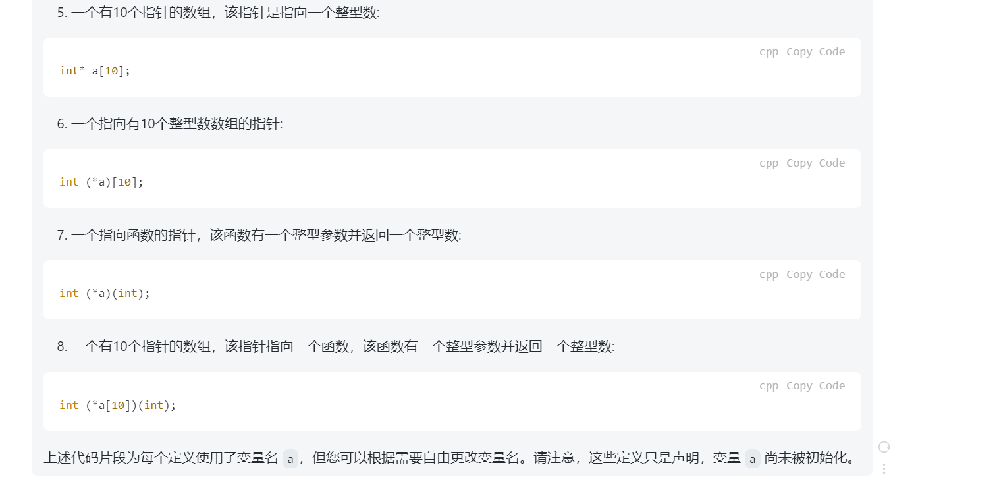

# 2023/8/24 海康笔试

## C++相关知识

### C库函数中malloc增长堆空间
在大多数类Unix系统(如linux)中，malloc函数通常通过使用bksk系统调用来增长堆空间。

### 快速排序 在内排序方法中平均线最好
1. 选择一个元素作为基准值（pivot）。
2. 将数组分成两部分，一部分包含所有小于基准值的元素，另一部分包含所有大于等于基准值的元素。
3. 对两个部分递归地应用快速排序算法。
4. 最后将两个部分连接起来，排序完成。

### C++中模板类的意义是

###
  
  

   
### 数组，堆栈和字符串都属于线性数据结构。但图不是线性数据结构，而是非线性数据结构。

### 指针可以进行的运算
==
！= 

### 编写一个strcpy函数

## 操作系统
### 信号量、线程、进程知识
- 信号量是进程间通信方式的一种，可用于进程同步，也可用于线程同步。
- 可以销毁正在等待的线程吗
  - 一般情况下，一个线程无法直接销毁或中止另一个正在等待的线程。线程的创建和销毁是由操作系统负责的，一个线程无法主动干预其他线程的生命周期，某些编程语言或框架中，提供了一些机制来终止或取消正在等待的线程

- 阻塞的操作可以被信号打断
  - 阻塞的操作可以被信号打断，这取决于信号的处理方式和操作系统的行为。
    在大多教情况下，当一个进程或线程正在执行阳裹操作如等侍输入、读现文件、风络通信等时，如果接收到一个处理方式为默认的信号，作系统会中断阳塞操作，并跳转到信号处理程序来执行相应的操作。这称为信号中断。
- 阻塞调用长时间无法返回不一定会导致程序崩溃，但它可能会对程序的性能和响应性产生负面影响.
- 每个线程的TID（Thread ID）在系统中是唯一的
- 每个进程的PID（Process在系统中是唯一的）
### NOR FLASH NAND FLASH DDR SSD中那个读取速度最快
  ，读取速度最快的是DDR(Double Data Rate )内存。DDR内存是计算机系统中常见的主存储器，用于临时存储正在执行的程序和数据
## 计算机网络
### 网络层
- Ping使用的是ICMP (Internet Control Message Protocol，互联网控制报文协议)来进行网络连接测试和诊断。ICMP是在网络层(第三层)上工作的一个协议，它用于在IP网络中传输控制消息
- 网络层的常见协议
    1. IP (Internet Protocol，互联网协议):IP是互联网上最基础和核心的协议之
    2. ICMP(ntemet (ontro Messae Proto，与联网控消息协): MP用于P网络上发送控制和消息，它提供了用于网络政》断、错误报告和网终状况反情的机
    3. ARP(Address Resolution Protocol，地址解析协议):ARP用于将P地址转换为对应的物理MAC地址，以便在局域网中进行数据通信。
    4. RARP(Reverse Address Resolution Protocol，反向地址解析协) : RARP用于根物理MAC地址获取对应的IP地，它的作与ARP相反
    5. IPsec (lintemet Protocol eurty，与联网协议安全): Pse是一个提供网络层安全的协议套性，用于实现加密认证和数据完整性保护等功能
    6. OSPF(Open Shortest Path First，开放最短路优先): OSPF是一种用于内部网关路由协议(IGRP)的路状态路由协议，用于计算最短路径并动态更新路由表。
    7. BGP (Border Gateway Protocol，边界网关协议)

## Linux知识
### Linux系统中 /etc /dev /usr /tmp目录分别是干嘛的
/etc 目录：
/etc 目录包含了系统的配置文件。在这个目录下，你可以找到各种与系统配置相关的文件，例如网络配置、用户账户信息、服务启动脚本等。一些常见的文件包括 /etc/passwd（存储用户账户信息）、/etc/group（存储用户组信息）、/etc/hosts（存储主机名与IP地址的映射）等。

/dev 目录：
/dev 目录是指设备（Devices）目录，包含了与系统硬件设备或虚拟设备相关的文件。在Linux系统中，一切皆文件，因此硬件设备也以文件的形式存在于 /dev 目录中。例如，你可以在 /dev 目录下找到硬盘、光驱、USB设备、打印机等设备的文件表示。这些文件是通过设备文件节点（device file nodes）来表示的，用来与对应的设备进行交互。

/usr 目录：
/usr 目录通常包含用户安装的软件和应用程序。这个目录下包含了许多子目录，如 /usr/bin（存放二进制可执行文件）、/usr/lib（存放库文件）、/usr/share（存放共享资源，如文档、图标等）等。大部分已安装的应用程序和系统工具都位于 /usr 目录下，这些程序可以供所有用户访问和使用。

/tmp 目录：
/tmp 目录是临时目录，用于存储临时文件。在该目录下的文件只有短暂的生命周期，不会长期储存在系统中。许多程序在执行过程中会产生临时文件，这些文件可以被多个程序共享或在系统重启后自动清理。但是请注意，由于是临时目录，定期清理和管理 /tmp 目录的内容是很重要的，以免占用过多磁盘空间。