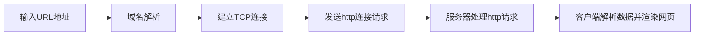

# 计网

## 1. 在浏览器中输入url地址后显示网页的过程
- 从数据交互的过程看
  - 域名解析，客户端通过DNS协议将URL解析为对应的IP地址，根据http或https得到端口号（80或443）
  - 建立TCP连接，客户端和服务器通过三次握手建立连接
  - 接着是http连接，客户端向服务器发送http连接请求；（http连接无需额外连接，直接通过已经建立的TCP连接发送）
  - 服务器对客户端发来的http请求进行处理，并返回响应；
  - 客户端解析数据并渲染网页

## 2.为什么TCP建立连接需要三次握手
因为TCP是双全工通信

假设A、B分别是客户端和服务器，则：
- 建立连接时，为了确保A能够发送给B，需要两次握手，为了确保B能够发送给A，需要两次握手，原本四次握手，但B响应A的连接请求和B发起对A的连接请求可以合并为一步，因此总共需要3次握手
- 断开连接时，B响应A断开请求并不是立即完成（需要释放服务器资源等操作），因此无法将B响应A的断开请求和B发起对A的断开请求合并为一步

## HTTP

### HTTP基本概念
#### HTTP是什么？
HTTP 是超文本传输协议，也就是HyperText Transfer Protocol。  

HTTP 是一个在计算机世界里专门在「两点」之间「传输」文字、图片、音频、视频等「超文本」数据的「约定和规范」。
#### HTTP常见的状态码有哪些？

