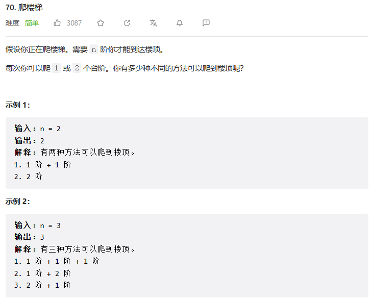

# 链表
## 203. 移除链表元素
- 题目描述
  
  

-思路及代码流程
~~~
思路：设置一个虚拟头结点进行移除节点操作  
1、设置一个虚拟头节点  
2、将虚拟头节点指向head，方便后面做删除操作  
3、创建一个cur指针，初始指向虚拟头节点  
4、遍历链表，知道cur指向链表尾节点  
    5、如果当前节点的值(cur->next)等于给定值val，则删除该节点  
    6、否则cur指向下一个节点  
7、获取处理后的链表头节点，并释放虚拟头节点内存  
8、返回处理后的链表头节点
~~~

- 代码
~~~c++
    /*
    定义了一个名为 ListNode 的结构体，它表示一个单链表的节点。结构体中包含三个成员变量：
    1 val 表示该节点存储的值；
    2 next 是一个指向下一个节点的指针。如果该节点是链表的最后一个节点，则 next 指向空指针 nullptr；
    3 ListNode()、ListNode(int x) 和 ListNode(int x, ListNode *next) 是构造函数，分别用于创建一个空节点、初始值为 x 的节点和初始值为 x，下一个节点为 next 的节点。
    通过这个结构体，我们可以创建一个单链表，并在其中添加、删除或修改节点。
    */
    // struct ListNode
    // {
    //     int val;
    //     ListNode *next;
    //     ListNode() : val(0), next(nullptr) {}
    //     ListNode(int x) : val(x), next(nullptr) {}
    //     ListNode(int x, ListNode *next) : val(x), next(next) {}
    // };

    思路：设置一个虚拟头结点进行移除节点操作  
1、设置一个虚拟头节点  
2、将虚拟头节点指向head，方便后面做删除操作  
3、创建一个cur指针，初始指向虚拟头节点  
4、遍历链表，知道cur指向链表尾节点  
    5、如果当前节点的值(cur->next)等于给定值val，则删除该节点  
    6、否则cur指向下一个节点  
7、获取处理后的链表头节点，并释放虚拟头节点内存  
8、返回处理后的链表头节点

class Solution{
public:
    ListNode* removeElements(ListNode* head, int val)
    {
        ListNode* dummyHead = new ListNode(0);
        dummyHead->next = head;
        ListNode* cur = dummyHead;
        while (cur->next != nullptr)
        {
            if (cur->next->val == val)
            {
                ListNode* temp = cur->next;
                cur->next = cur->next->next;
                delete temp;
            }
            else{
                cur = cur->next;
            }
        }
        head = dummyHead->next;
        delete dummyHead;
        return head;
    }
};
~~~

# 动态规划
动态规划五部曲：
  1. 确定dp数组以及下标的含义
  2. 确定递推公式
  3. dp数组如何初始化
  4. 确定遍历顺序
  5. 举例推导dp数组
## 基础题目
### 509.斐波那契数
题目链接：https://leetcode.cn/problems/fibonacci-number/
  

### 70.爬楼梯
  

动态规划五部曲：
  1. 确定dp数组以及下标的含义
  2. 确定递推公式
  3. dp数组如何初始化
  4. 确定遍历顺序
  5. 举例推导dp数组
   
__Step 1: 确定dp数组以及下标的含义__   
在这个问题中，我们可以定义一个长度为 n+1 的dp数组，其中 dp[i] 表示到达第i阶楼梯的不同方法数。

__Step 2: 确定递推公式__  
对于第 i 阶楼梯，我们有两种方式可以到达：

  - 若选择爬1个台阶，则问题转化为爬上 i-1 阶楼梯的子问题。因此，- 对应的方法数为 dp[i-1]。
  - 若选择爬2个台阶，则问题转化为爬上 i-2 阶楼梯的子问题。对应的方法数为 dp[i-2]。 综上所述，到达第 i 阶楼梯的不同方法数为 dp[i] = dp[i-1] + dp[i-2]。

__Step 3: dp数组如何初始化__    
根据递推公式可知，当楼梯阶数为 0 时，只有一种方法（即不爬）。因此，我们初始化 dp[0] = 1，同时也需要将 dp[1] 初始化为 1。

__Step 4: 确定遍历顺序__  
由于当前状态只与前两个状态有关，所以遍历顺序可以是从前往后依次计算 dp[2]、dp[3]、...、dp[n]。

__Step 5: 举例推导dp数组__  
假设楼梯阶数 n = 5，我们可以通过填表的方式来推导 dp 数组：
- C++代码
~~~c++
#include <iostream>
#include <vector>
#include <string>

using namespace std;

/*
 * @lc app=leetcode.cn id=70 lang=cpp
 *
 * [70] 爬楼梯
 */

// @lc code=start
class Solution {
public:
    int climbStairs(int n) {
        vector<int> dp(n + 1);//定义一个长度为n+1的dp数组
        //初始化dp数组
        dp[0] = 1;
        dp[1] = 1;
        //遍历顺序，从前往后依次计算dp[2]、dp[3]、...、dp[n]
        printf("i dp[i]\n");
        printf("0 1\n");
        printf("1 1\n");
        for (int i = 2; i < n + 1; i++){
            printf("%d ",i);
            dp[i] = dp[i - 1] + dp[i - 2];//递推公式
            printf("%d\n",dp[i]);
        }
        return dp[n];
    }
};
// @lc code=end

int main()
{
    Solution().climbStairs(6);
    return 0;
}

~~~

