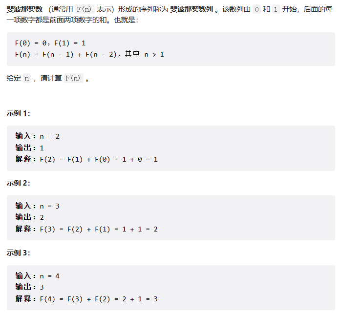

# 链表
## 203. 移除链表元素
- 题目描述
  
  

-思路及代码流程
~~~
思路：设置一个虚拟头结点进行移除节点操作  
1、设置一个虚拟头节点  
2、将虚拟头节点指向head，方便后面做删除操作  
3、创建一个cur指针，初始指向虚拟头节点  
4、遍历链表，知道cur指向链表尾节点  
    5、如果当前节点的值(cur->next)等于给定值val，则删除该节点  
    6、否则cur指向下一个节点  
7、获取处理后的链表头节点，并释放虚拟头节点内存  
8、返回处理后的链表头节点
~~~

- 代码
~~~c++
    /*
    定义了一个名为 ListNode 的结构体，它表示一个单链表的节点。结构体中包含三个成员变量：
    1 val 表示该节点存储的值；
    2 next 是一个指向下一个节点的指针。如果该节点是链表的最后一个节点，则 next 指向空指针 nullptr；
    3 ListNode()、ListNode(int x) 和 ListNode(int x, ListNode *next) 是构造函数，分别用于创建一个空节点、初始值为 x 的节点和初始值为 x，下一个节点为 next 的节点。
    通过这个结构体，我们可以创建一个单链表，并在其中添加、删除或修改节点。
    */
    // struct ListNode
    // {
    //     int val;
    //     ListNode *next;
    //     ListNode() : val(0), next(nullptr) {}
    //     ListNode(int x) : val(x), next(nullptr) {}
    //     ListNode(int x, ListNode *next) : val(x), next(next) {}
    // };

    思路：设置一个虚拟头结点进行移除节点操作  
1、设置一个虚拟头节点  
2、将虚拟头节点指向head，方便后面做删除操作  
3、创建一个cur指针，初始指向虚拟头节点  
4、遍历链表，知道cur指向链表尾节点  
    5、如果当前节点的值(cur->next)等于给定值val，则删除该节点  
    6、否则cur指向下一个节点  
7、获取处理后的链表头节点，并释放虚拟头节点内存  
8、返回处理后的链表头节点

class Solution{
public:
    ListNode* removeElements(ListNode* head, int val)
    {
        ListNode* dummyHead = new ListNode(0);
        dummyHead->next = head;
        ListNode* cur = dummyHead;
        while (cur->next != nullptr)
        {
            if (cur->next->val == val)
            {
                ListNode* temp = cur->next;
                cur->next = cur->next->next;
                delete temp;
            }
            else{
                cur = cur->next;
            }
        }
        head = dummyHead->next;
        delete dummyHead;
        return head;
    }
};
~~~

# 动态规划
## 基础题目
### 509.斐波那契数
题目链接：https://leetcode.cn/problems/fibonacci-number/
  

