- [1](#1)
  - [1.1](#11)
- [第二章 简单的 HTTP协议](#第二章-简单的-http协议)
  - [2.1 HTTP 协议用于客户端和服务器端之间的通信](#21-http-协议用于客户端和服务器端之间的通信)
  - [2.2 通过请求和响应的交换达成通信](#22-通过请求和响应的交换达成通信)
  - [2.3 HTTP 是不保存状态的协议](#23-http-是不保存状态的协议)
  - [2.4 请求URI定位资源](#24-请求uri定位资源)
  - [2.5告知服务器意图的HTTP方法](#25告知服务器意图的http方法)
  - [2.6 使用方法下达命令](#26-使用方法下达命令)
  - [2.7 持久连接节省通信量](#27-持久连接节省通信量)
    - [2.7.1　持久连接](#271持久连接)
    - [2.7.2　管线化](#272管线化)
  - [2.8　使用 Cookie 的状态管理](#28使用-cookie-的状态管理)
- [第三章 HTTP报文内的 HTTP信息](#第三章-http报文内的-http信息)
  - [3.1 HTTP报文](#31-http报文)
  - [3.2 请求报文及响应报文的结构](#32-请求报文及响应报文的结构)
  - [3.3 编码提升传输速率](#33-编码提升传输速率)
    - [3.3.1　报文主体和实体主体的差异](#331报文主体和实体主体的差异)
    - [3.3.2　压缩传输的内容编码](#332压缩传输的内容编码)
    - [3.3.3  分割发送的分块传输编码](#333--分割发送的分块传输编码)
  - [3.4　发送多种数据的多部分对象集合](#34发送多种数据的多部分对象集合)
  - [3.5　获取部分内容的范围请求](#35获取部分内容的范围请求)
  - [3.6　内容协商返回最合适的内容](#36内容协商返回最合适的内容)
- [第四章 返回结果的 HTTP状态码](#第四章-返回结果的-http状态码)
  - [4.1　状态码告知从服务器端返回的请求结果](#41状态码告知从服务器端返回的请求结果)
  - [4.2 2XX 成功](#42-2xx-成功)
    - [4.4.1 200 OK](#441-200-ok)
    - [4.2.2　204 No Content](#422204-no-content)
    - [206 Partial Content](#206-partial-content)

# 1
## 1.1
# 第二章 简单的 HTTP协议
## 2.1 HTTP 协议用于客户端和服务器端之间的通信
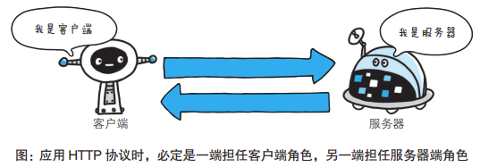  
## 2.2 通过请求和响应的交换达成通信
- 具体实例

    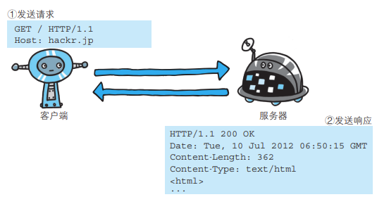  

- 下面则是从客户端发送给某个 HTTP 服务器端的请求报文中的内容。

~~~
GET /index.htm HTTP/1.1
Host: hackr.jp
~~~
起始行开头的GET表示请求访问服务器的类型， 称为 ——__方法__（method）。随后的字符串 /index.htm 指明了请求访问的资源对象，也叫
做请求 URI（request-URI）。最后的 HTTP/1.1，即 HTTP 的 __版本号__，用
来提示客户端使用的 HTTP 协议功能。

这段请求内容的意思是：请求访问某台 HTTP 服务器上
的 /index.htm 页面资源。
- **请求报文是由请求方法、请求 URI、协议版本、可选的请求首部字段和内容实体构成的**
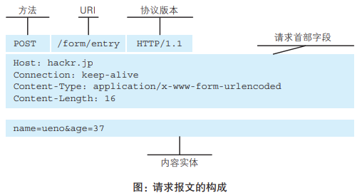  
- **响应报文基本上由协议版本、状态码（表示请求成功或失败的数字代码）、用以解释状态码的原因短语、可选的响应首部字段以及实体主体构成**
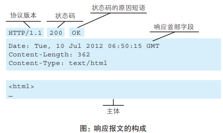  

## 2.3 HTTP 是不保存状态的协议
HTTP 是一种不保存状态，即无状态（stateless）协议。

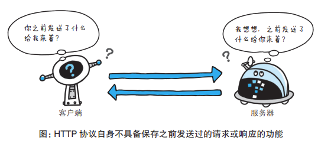  
为了实现实现期望的保持状态功能，引入了 Cookie 技术。

## 2.4 请求URI定位资源
当客户端请求访问资源而发送请求时，URI 需要将作为请求报文中
的请求 URI 包含在内。指定请求 URI 的方式有很多。

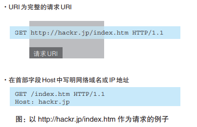  

## 2.5告知服务器意图的HTTP方法
- **GET：获取资源**

  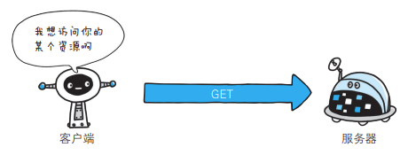  

- **POST：传输实体主体**
  
    

- **PUT：传输文件**

  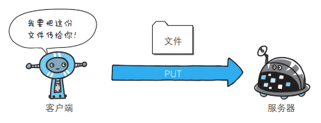  

- **HEAD：获得报文首部**

  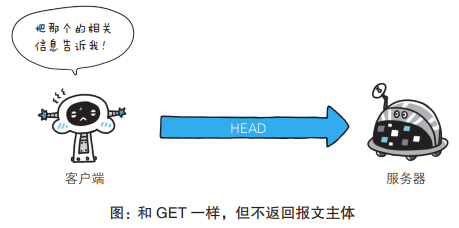  

- **DELETE:删除文件**

    

- **OPTIONS：询问支持的方法**

    

- **TRACE：追踪路径**（不常用）
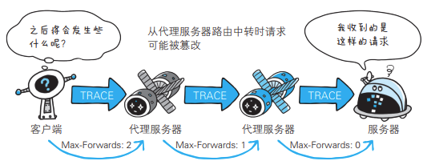  

- **CONNECT：要求用隧道协议连接代理**

    CONNECT 方法要求在与代理服务器通信时建立隧道，实现用隧道
协议进行 TCP 通信。主要使用 SSL（Secure Sockets Layer，安全套接
层）和 TLS（Transport Layer Security，传输层安全）协议把通信内容加
密后经网络隧道传输。
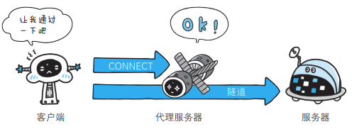  

## 2.6 使用方法下达命令
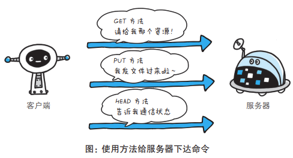  

## 2.7 持久连接节省通信量
HTTP 协议的初始版本中，每进行一次 HTTP 通信就要断开一次TCP 连接。
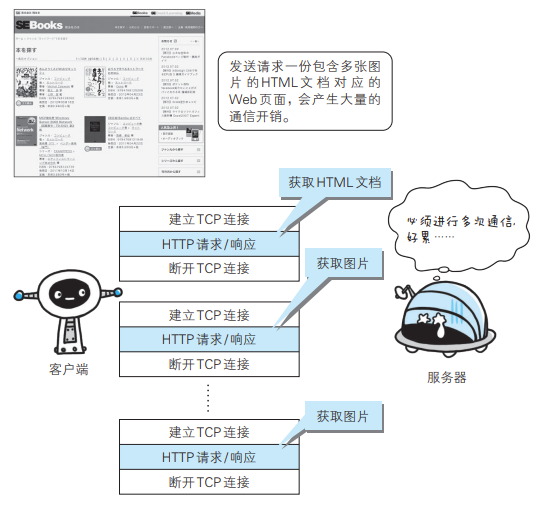  

### 2.7.1　持久连接
特点：只要任意一端没有明确提出断开连接，则保持 TCP 连接状态。

- **在 HTTP/1.1 中，所有的连接默认都是持久连接**
  
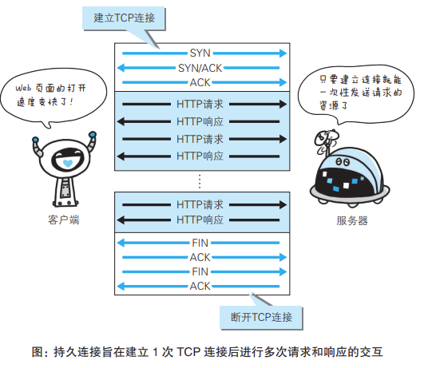  

### 2.7.2　管线化
同时并行发送多个请求
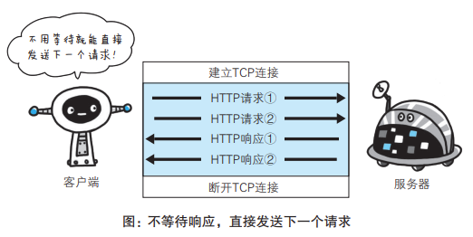  

## 2.8　使用 Cookie 的状态管理
- 没有 Cookie 信息状态下的请求
  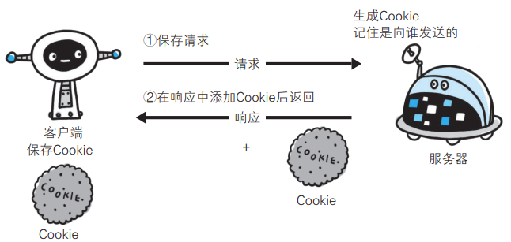  

- 第 2 次以后（存有 Cookie 信息状态）的请求
  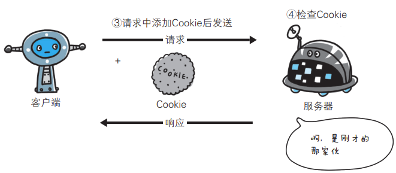 

①请求报文（没有 Cookie 信息的状态）
~~~HTTP
GET /reader/ HTTP/1.1
Host: hackr.jp
*首部字段内没有Cookie的相关信息
~~~
②响应报文（服务器端生成 Cookie 信息）
~~~HTTP
HTTP/1.1 200 OK
Date: Thu, 12 Jul 2012 07:12:20 GMT
Server: Apache
＜Set-Cookie: sid=1342077140226724; path=/; expires=Wed,
10-Oct-12 07:12:20 GMT＞
Content-Type: text/plain; charset=UTF-8 
~~~
③请求报文（自动发送保存着的 Cookie 信息）
~~~HTTP
GET /image/ HTTP/1.1
Host: hackr.jp
Cookie: sid=1342077140226724
~~~

# 第三章 HTTP报文内的 HTTP信息
## 3.1 HTTP报文
请求端（客户端）的HTTP 报文叫做请求报文，响应端（服务器端）的叫做响应报文

## 3.2 请求报文及响应报文的结构
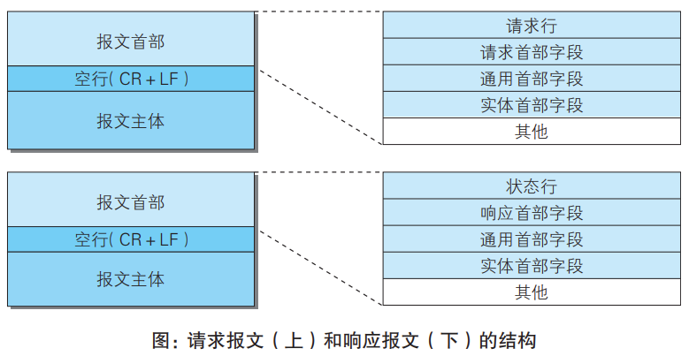  
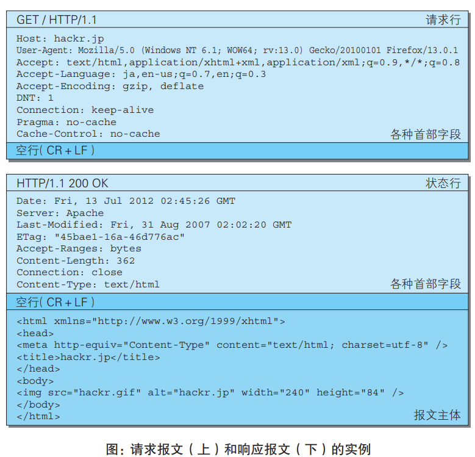  

## 3.3 编码提升传输速率
### 3.3.1　报文主体和实体主体的差异
-  报文（message）
  
    是 HTTP 通信中的基本单位，由 8 位组字节流（octet sequence，
其中 octet 为 8 个比特）组成，通过 HTTP 通信传输。
-   实体（entity）
  
    作为请求或响应的有效载荷数据（补充项）被传输，其内容由实
体首部和实体主体组成。

### 3.3.2　压缩传输的内容编码
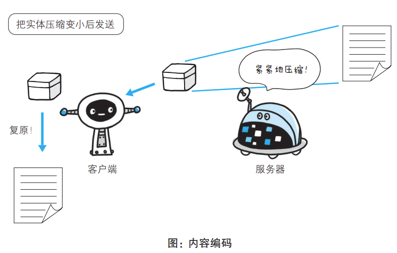  

### 3.3.3  分割发送的分块传输编码
让浏览器逐步显示页面
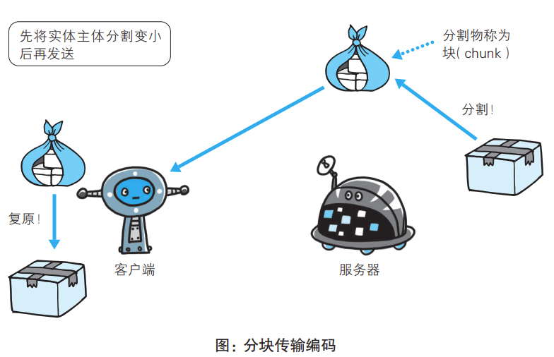  

## 3.4　发送多种数据的多部分对象集合
-  multipart/form-data
-   multipart/byteranges

## 3.5　获取部分内容的范围请求
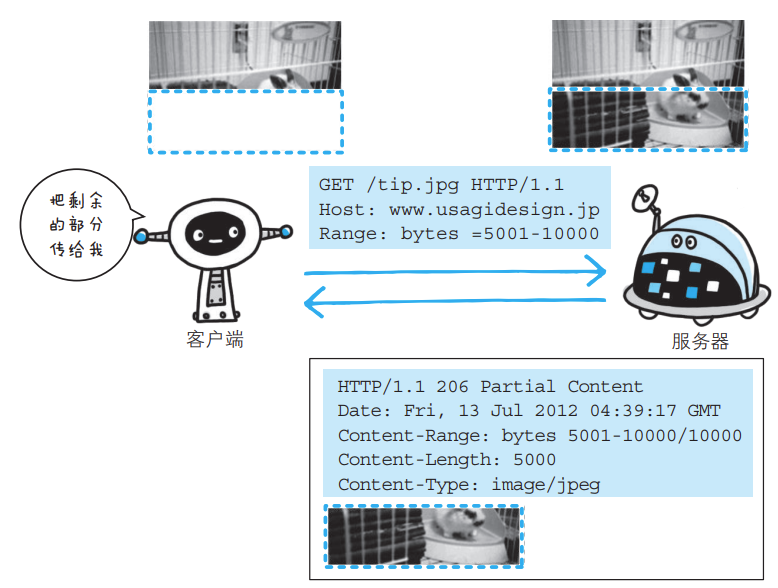  

## 3.6　内容协商返回最合适的内容

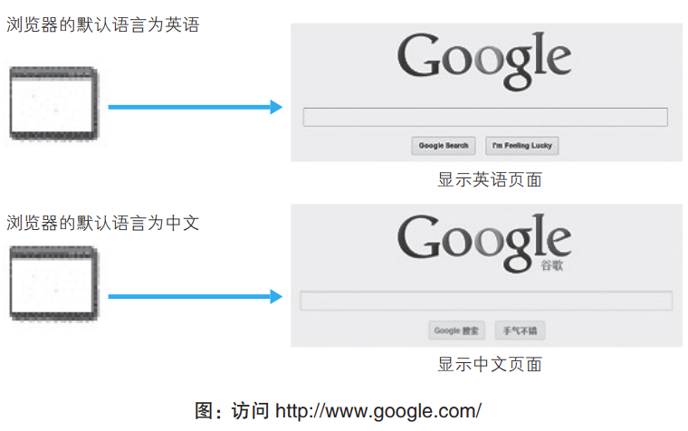  
有以下三种类型
- 服务器驱动协商（Server-driven Negotiation）
- 客户端驱动协商（Agent-driven Negotiation）
- 透明协商（Transparent Negotiation）

# 第四章 返回结果的 HTTP状态码

## 4.1　状态码告知从服务器端返回的请求结果
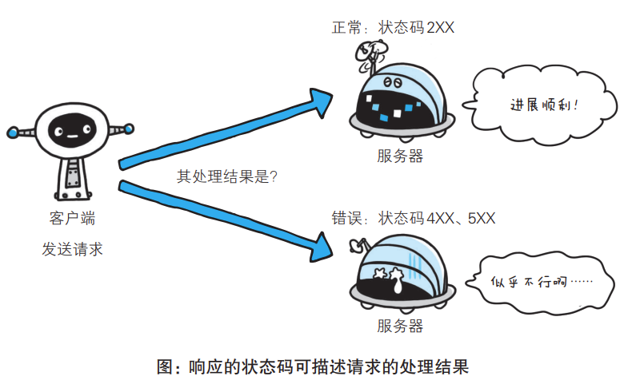  

||类别| 原因短语|
|---| ----------- | ----------- |
|1XX |Informational（信息性状态码）| 接收的请求正在处理
|2XX |Success（成功状态码）| 请求正常处理完毕
|3XX |Redirection（重定向状态码）| 需要进行附加操作以完成请求
|4XX| Client Error（客户端错误状态码）| 服务器无法处理请求
|5XX |Server Error（服务器错误状态码）| 服务器处理请求出错

## 4.2 2XX 成功

### 4.4.1 200 OK
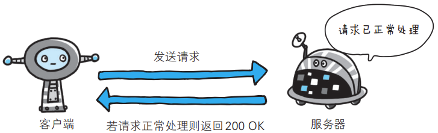 

### 4.2.2　204 No Content
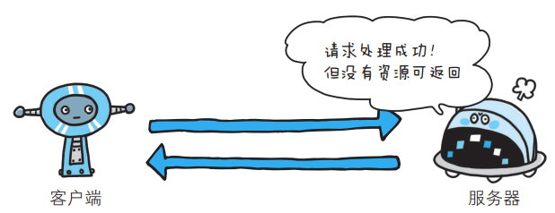  

### 206 Partial Content
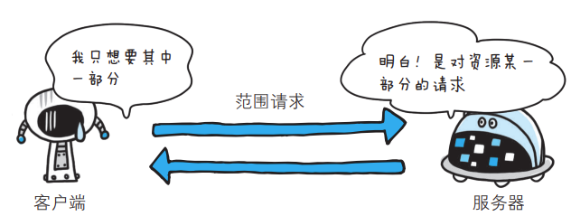  

fafaw