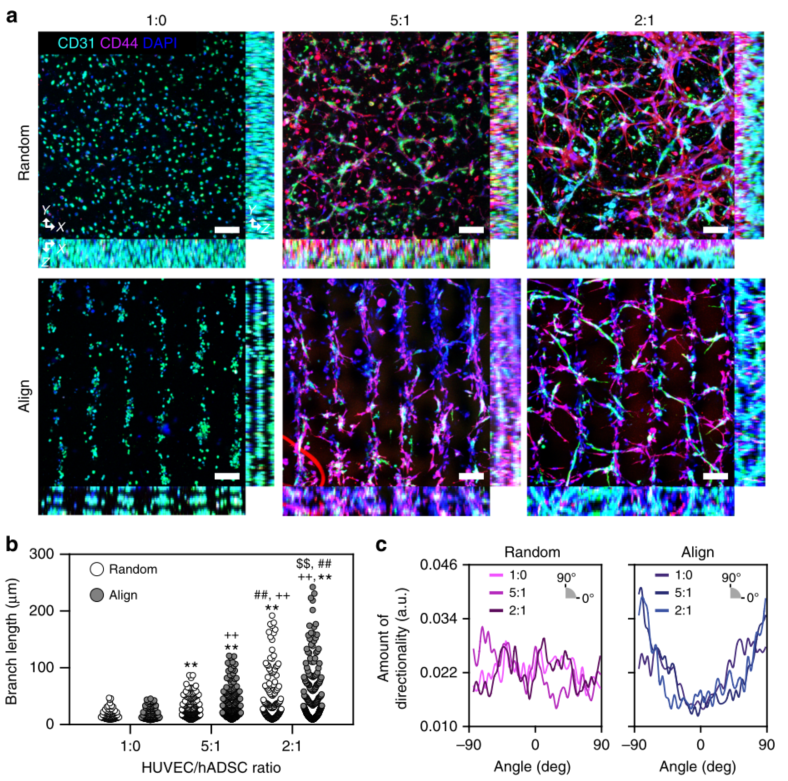
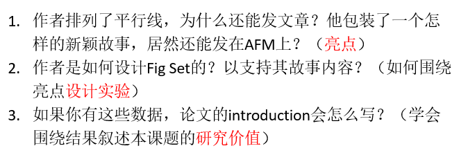

# My Article Title
## __需要提到的点__
1.生物组织结构需要各向异性，具有明确细胞排列
## Introduction P1
- __文章切入点__
  

# High-resolution acoustophoretic 3D cell patterning to construct functional collateral cylindroids for ischemia therapy 
高分辨率声光3D细胞图案化构建用于缺血治疗的功能性侧支柱体

## Introduction P1
- __提出方法意义__:功能性三维（3D）组织的体外制造在技术上具有挑战性，但对于组织工程和再生医学领域受损组织的修复或替换至关重要1。许多小组试图在体内条件下生产人工组织，包括不同类型细胞的共培养和生长因子的调节2。
- __提出方法问题挑战/科学假设__:最近的仿生研究表明，不仅生物和生化环境，组织的机械属性，包括物理和结构属性，对组织结构的分化、器官发生和成熟至关重要3

## Fig3 SSAW诱导后肢肌肉中微血管再现的3D细胞模式
  
### fig.3b,c
__分析了random和pattern内皮排列的伸长率和细长方向__

  

# __<u>Continuous</u> Production of Acoustically Patterned Cells Within Hydrogel Fibers for Musculoskeletal Tissue Engineering__
在用于肌肉骨骼组织工程的水凝胶纤维中连续生产声学图案细胞
## Introduction P1
- __提出工作意义__:生物工程组织模拟物可用于再生医学、药物发现和软机器人
- __提出细胞封装方法__:设计组织模型的一种常见方法依赖于将细胞封装在3D生物材料中，与在2D硬塑料基底上生长的细胞相比，这可能会导致更多的生理细胞行为。
- __提出封装细胞的材料：水凝胶__:水凝胶由于其可调的机械性能和包括各种生物化学线索以支持细胞功能的能力，已成为一种用于3D封装的通用生物材料。__提出封装细胞的材料：水凝胶__
- __水凝胶材料优点__:基于水凝胶的封装提高了一系列应用的组织模拟物的质量，包括心血管、视网膜、神经和肌肉骨骼组织。
- __科学问题1：水凝胶封装细胞导致各向同性__:然而，3D水凝胶中的细胞包封通常导致<u>各向同性</u>的细胞组织。然而，许多生物组织，包括骨骼肌、肌腱、韧带和心脏组织，都是<u>各向异性</u>的，具有明确的细胞排列。此外，生理功能可能取决于这种细胞各向异性。例如，单轴肌肉收缩需要肌肉纤维同轴排列。
- __总结：提出目标__:因此，在3D培养中各向异性组织细胞的策略将有助于设计结构化组织的天然细胞结构和功能

## Introduction P2 方法讨论引出声学
- __列举方法__:已经探索了几种在3D培养中对细胞进行模式化的策略。
  - __机械和电__：已经使用机械和电刺激在肌肉骨骼组织模型中诱导了结构组织。
  - __微流体__ :等技术也已用于指导神经元细胞中的网络形成。
- __提出声学方法__ :在3D生物材料中组织细胞的一种新兴方法是通过使用 __声学力__，这提供了特定的优势，因为它是 __无标记__ 的，并且可以 __缩放(scaled)__ ，同时实现细胞的可调图案。 
- __声学优点__ 声流体学是一种 __非接触(non-contact)__ 和 __可编程__ 的方法，用于在液体中图案化物体，包括细胞
- __原理介绍__:这种现象是基于粒子在强声场中所受的力。来自粒子的散射声场与入射声压场相互作用，产生声辐射力。流体腔内驻波的形成可以由于高Q因子而放大声压，并且在细胞被驱动到压力节点时提供对细胞位置的控制
- __声学具有生物相容性__:声学流体装置已经将这些特征用于生物应用，证明了声流体操作的细胞相容性

## Introduction P3 声学讨论段落
声流体学组织细胞的能力促使使用不同形式的声激发来形成各向异性的载有细胞的结构
- __举例1 SAW__:在高分辨率（≈50μm）的声表面波（SAW）装置的共同培养中，对人脐静脉内皮细胞（HUVECs）和人脂肪来源干细胞（hADSCs）进行图案化，以形成血管网络。
- __举例2 BAW__:与非图案化对照相比，声学图案化改善了小鼠中这些血管构建体与宿主组织的整合。体声波（BAW）设备 __已被用于制造骨骼肌组织结构、血管网络和软骨__，证明了对细胞间距的可调控制
- __BAW与SAW比较__:对于BAW装置，声波在整个流体腔中工作，以产生所需的声场。与SAW器件相比，这使得能够直接图案化更大的3D组织构造。
- __举例 振动板__:科学家们使用振动板设备生成内皮细胞和间充质干细胞的模式，利用表面波显示出类似于Chladni图的空间组织。使用类似的振动板装置对心肌细胞进行构图，以产生心脏组织的3D模型。
- __举例 声全息__: 在最近的另一项工作中，相位调制声场被用于创建用于细胞聚集的声学全息图
- __总结并提出不足__:这些独特的装置中的每一个都展示了使用声流控技术对细胞进行图案化的优势。然而，以可扩展的方式 __连续__ 地对细胞进行声学图案化仍然是一个挑战。
  
## Introduction P4 作者工作方法
- 利用声流控技术提供的优势，设计了一种基于玻璃毛细管的设备
- 在连续生产的水凝胶纤维内实现具有可调间距的细胞的可重复图案化。这使我们能够连续地对细胞进行构图，以提高3D组织结构的吞吐量。
- 利用这种能力在水凝胶中以平行线组织细胞，以产生模仿骨骼肌的组织结构。
- 加甲基丙烯酰基明胶水凝胶制剂中的局部细胞密度，从而促进肌管的形成。

# __Tissue Engineering Cartilage with Deep ZoneCytoarchitecture by High-Resolution Acoustic Cell Patterning__
应用高分辨率声学细胞成像技术构建深区细胞结构的组织工程软骨

## Introduction P1
- __提出科学假设__：从细胞排列到细胞外基质成分的组织，天然组织的协调功能是由保守的结构特征实现的
  当寻求设计功能性组织移植物或相关生物模型时，复制这些结构方面是至关重要的。
- __提出方法__:生成复杂组织结构有两种总体策略。
  - 第一种方法是在组织培养和成熟过程中提供生物化学因子、生物材料特性或机械负荷的不均匀分布，[2，3]指导性线索，可以在空间上调节细胞定向、[4]细胞分化、[5-7]基质组装、[6-8]或基质结合等过程。[9] 
  - 第二种方法是在组织工程之前，使用自引导组装、[10，11]定向组装、[11，12]或减法制造等方法制造复杂结构。
- __目前现状__:能够制造具有复杂宏观结构[14-16]或互连血管通道的组织

## Introduction P2

- __提出不足和挑战__:该领域的一个持久挑战是复制天然组织中存在的复杂细胞结构。
- __解决方法1及不足__:高分辨率微流体/微滴生物打印的最新进展为工程精细细胞特征提供了前景[20，21]然而，这些机械过程可能在组织组装过程中出现剪切诱导的损伤。(引出声学)
- __引出声学并简介__：这些限制导致人们对使用光、磁场或声场的非接触细胞操作越来越感兴趣。[22]特别是，超声波驻波已被用于施加声辐射力，该力可以将未标记的活细胞群体远程操纵到静态声压节点中。
- __声学工作现状__:单个压力节点可用于产生用于组织工程的致密细胞聚集体，这种方法已用于形成用于软骨组织工程的微质体培养物[25]，而多节点场可用于形成图案化细胞阵列。[26，27]后一种方法最近被应用于通过用有组织的细胞阵列预图案化生物材料来设计复杂组织。值得注意的例子包括声学模式的内皮细胞、[28，29]脂肪干细胞、[29]神经祖细胞、[30]心肌细胞、[31]和骨骼成肌细胞。

## Introduction P3
- __重建深区软骨提出__:我们表明声学细胞模式可以用于重建深部关节软骨的排列细胞结构。深区是关节软骨的四个经典解剖区域之一，位于中间区和钙化区之间。[33]该区域的一个关键特征是软骨细胞以平行于关节纵轴的均匀柱状组织（图1a）
- __特征对应高分辨率操作__:在人类软骨中，这些特征通常为1-2个细胞宽，间距约为80μm，[34，35]，需要高分辨率的细胞操作。在这里，我们使用高频（6.7MHz）超声驻波在琼脂糖水凝胶的整个体积中将牛软骨细胞声学模式化为单细胞宽度的线性阵列（图1b）。
- __工作优势__:在整个35天的软骨组织工程过程中，声学模式的细胞特征都得到了保留，软骨细胞阵列产生了具有复合胶原纤维的软骨细胞外基质。我们还验证了暴露于超声场对软骨细胞活力或
- __总结展望__:这些结果证明了声学细胞图案化在软骨组织工程中的适用性，并为制造相关的体外软骨模型和用于关节软骨修复的各向异性组织移植物开辟了新的机会

# __Engineering <u>Anisotropic</u> Muscle Tissue using Acoustic Cell Patterning__
利用声学细胞模式构建各向异性肌肉组织

## Introduction P1
- __各向同性的方法不行__:大多数生物工程策略使用具有各向同性细胞分布的材料来产生均匀的组织结构。然而，这些工程组织通常缺乏协调的机械功能、生物成熟和体内整合所需的微观细胞组织。
- __解决方法列举-生物打印、材料线索及缺点__:大多数生物工程策略使用具有各向同性细胞分布的材料来产生均匀的组织结构。然而，这些工程组织通常缺乏协调的机械功能、生物成熟和体内整合所需的微观细胞组织。
- __引出声学方法__:这些限制中的许多可以通过声学操作来解决，通过声学操作，细胞被平移到超声波驻波的静压节点。[6] 与生物打印或材料线索相比，声学图案化提供了更简单的制造、中等的特征分辨率（≈2-3个单元）和相当的速度（<10分钟
- __声学发展现状__：此外，声学图案化能够对生物材料中的细胞群体进行远程和动态操作，同时可以使用基于全息图的声学生成复杂的非线性结构。[7] 迄今为止，2D和3D声学细胞模式已被用于研究生物过程，如轴突引导、[8]血管生成、[9]神经分化、[10]和心肌细胞搏动。[11,12]
- __作者工作__:我们使用超声波驻波来引导成肌细胞在胶原基水凝胶中的组装，然后刺激这些图案化材料进行原位成肌和设计成束排列的肌管（图1A）。这种方法也导致了显著的拉伸各向异性和增强的肌纤维生成，为各向异性组织形态的工程提供了一个新的平台