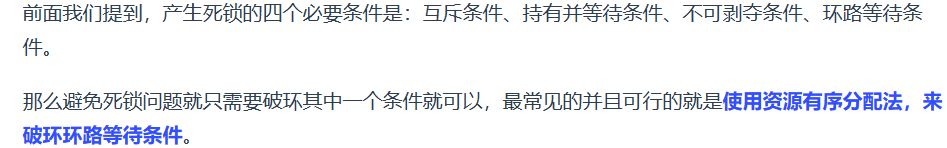

# 2023/7/25

- [X] 拍摄Jove Fig1 如下图
  
  - [X] 下午四点半到公司去取缪师兄工作设备
  - [X] 晚上试着搭建平台预运行
    

- [X] 阅读Jove手稿的Protocol细节——[Jove-Protocol](./文献笔记/Jove-Protocol.md)
- [X] 牛客题霸101  
[BM17 二分查找-I](https://www.nowcoder.com/practice/d3df40bd23594118b57554129cadf47b?tpId=295&tqId=1499549&ru=%2Fpractice%2Fabc3fe2ce8e146608e868a70efebf62e&qru=%2Fta%2Fformat-top101%2Fquestion-ranking&sourceUrl=%2Fexam%2Foj)  
[BM18 二维数组中的查找](https://www.nowcoder.com/practice/abc3fe2ce8e146608e868a70efebf62e?tpId=295&tqId=23256&ru=%2Fpractice%2Fabc3fe2ce8e146608e868a70efebf62e&qru=%2Fta%2Fformat-top101%2Fquestion-ranking&sourceUrl=%2Fexam%2Foj)  
    每一行查找一次：
    时间复杂度：O(Mlog N )
    空间复杂度：O(1)  
[BM19 寻找峰值](https://www.nowcoder.com/practice/fcf87540c4f347bcb4cf720b5b350c76?tpId=295&tqId=2227748&ru=/exam/oj&qru=/ta/format-top101/question-ranking&sourceUrl=%2Fexam%2Foj)  
while(left < right>)没有等于，因为等于的时候输出了

- [X] 面经学习  

# 2023/7/26

- [ ] 做一个师兄一样的新器件用于拍照——__未完成__
  
- [X] 复现三维点阵实验（达到显微镜下可以观察到的效果）

- [X] 总结实验，细致的记录[Protocol](./文献笔记/Jove-Protocol.md)
  
- [X] 牛客题霸101  
[BM23 二叉树的前序遍历](https://www.nowcoder.com/practice/5e2135f4d2b14eb8a5b06fab4c938635?tpId=295&tqId=2291302&ru=/exam/oj&qru=/ta/format-top101/question-ranking&sourceUrl=%2Fexam%2Foj)——输入参数vector要取地址  
[BM24 二叉树的中序遍历](https://www.nowcoder.com/practice/0bf071c135e64ee2a027783b80bf781d?tpId=295&tags=&title=&difficulty=0&judgeStatus=0&rp=0&sourceUrl=%2Fexam%2Foj)  
[BM25 二叉树的后序遍历](https://www.nowcoder.com/practice/1291064f4d5d4bdeaefbf0dd47d78541?tpId=295&tqId=2291301&ru=/exam/oj&qru=/ta/format-top101/question-ranking&sourceUrl=%2Fexam%2Foj)  
[BM26 求二叉树的层序遍历](https://www.nowcoder.com/practice/04a5560e43e24e9db4595865dc9c63a3?tpId=295&tqId=644&ru=/exam/oj&qru=/ta/format-top101/question-ranking&sourceUrl=%2Fexam%2Foj)——增加队列
- [X] 学习面经

# 2023/7/27

- [X] 牛客题霸101   
[BM20 数组中的逆序对](https://www.nowcoder.com/practice/96bd6684e04a44eb80e6a68efc0ec6c5?tpId=295&tqId=23260&ru=/exam/oj&qru=/ta/format-top101/question-ranking&sourceUrl=%2Fexam%2Foj)——合并部分真难 [参考图解](https://leetcode.cn/problems/shu-zu-zhong-de-ni-xu-dui-lcof/solution/jian-zhi-offer-51-shu-zu-zhong-de-ni-xu-pvn2h/)  
[BM21 旋转数组的最小数字](https://www.nowcoder.com/practice/9f3231a991af4f55b95579b44b7a01ba?tpId=295&tqId=23269&ru=/exam/oj&qru=/ta/format-top101/question-ranking&sourceUrl=%2Fexam%2Foj)_二分  
[BM22 比较版本号](https://www.nowcoder.com/practice/2b317e02f14247a49ffdbdba315459e7?tpId=295&tqId=1024572&ru=/exam/oj&qru=/ta/format-top101/question-ranking&sourceUrl=%2Fexam%2Foj)_双指针  
[BM27 按之字形顺序打印二叉树](https://www.nowcoder.com/practice/91b69814117f4e8097390d107d2efbe0?tpId=295&tqId=23454&ru=/exam/oj&qru=/ta/format-top101/question-ranking&sourceUrl=%2Fexam%2Foj)_和BM26层序遍历的差别只在于插入vector是push_back()还是insert到最前面  

- [X] 学习面经

- [X] Jove从开启声场到调出三维点阵，具体时间参数需要记录  
  - 经过下面两步的调整，Z方向的观察也于XY方向类似了  

- [X] 做一个Z方向PZT贴在底部的器件进行尝试——效果很好继续推进

    

- [X] 尝试Z方向是否可以先调出水平面，难点在于能否从侧面观察到   
  - 手持摄像头可以在侧面观察到：
  
    

  

# 2023/07/28

- [ ] 制备一个干净的XYZ-PZT器件用于拍照——Z-PTZ在底部（__拍摄的时候加培养基__）——__未完成__
  
  

- [X] 在排列实验中寻找手持摄像头的最佳架设角度和架设方法（没有支架如何解决？），以便下一步移入洁净台进行实验

- [X] 学习面经  

- [X] 牛客题霸101  
[BM28 二叉树的最大深度](https://www.nowcoder.com/practice/8a2b2bf6c19b4f23a9bdb9b233eefa73?tpId=295&tqId=642&ru=/exam/oj&qru=/ta/format-top101/question-ranking&sourceUrl=%2Fexam%2Foj)  
[BM29 二叉树中和为某一值的路径(一)](loud.tencent.com/act/campus?fromSource=gwzcw.1293314.1293314.1293314&cps_key=d543d0ed22c1474aaa6949df3eba981a)  
[BM30 二叉搜索树与双向链表](https://www.nowcoder.com/practice/947f6eb80d944a84850b0538bf0ec3a5?tpId=295&tags=&title=&difficulty=0&judgeStatus=0&rp=0&sourceUrl=%2Fexam%2Foj)  
[BM31 对称的二叉树](https://www.nowcoder.com/practice/ff05d44dfdb04e1d83bdbdab320efbcb?tpId=295&tags=&title=&difficulty=0&judgeStatus=0&rp=0&sourceUrl=%2Fexam%2Foj)  
[BM32 合并二叉树](https://www.nowcoder.com/practice/7298353c24cc42e3bd5f0e0bd3d1d759?tpId=295&tqId=1025038&ru=/exam/oj&qru=/ta/format-top101/question-ranking&sourceUrl=%2Fexam%2Foj)  

# 2023/07/29
- [X] 制备一个新器件（底部PZT），1.思考怎么光固化好 2. 拍摄图片
  
- [ ] 尝试摸索在洁净台排列三维点阵结构 

- [X] 牛客题霸101 

  [BM34 判断是不是二叉搜索树](https://www.nowcoder.com/practice/a69242b39baf45dea217815c7dedb52b?tpId=295&tqId=2288088&ru=/exam/oj&qru=/ta/format-top101/question-ranking&sourceUrl=%2Fexam%2Foj)

  [BM35 判断是不是完全二叉树](https://www.nowcoder.com/practice/8daa4dff9e36409abba2adbe413d6fae?tpId=295&tags=&title=&difficulty=0&judgeStatus=0&rp=0&sourceUrl=%2Fexam%2Foj)-层序遍历

- [X] 学习面经--只学了一点点

# 2023/07/30

- [X] 牛客题霸101 BM36/37/38/39/40

- [X] 学习面经-TCP
  

# 2023/07/31

- [X] 学习面经
    
  

- [X] 刷题

# 2023/08/01

- [X] 数学建模-综合评价方法

- [X] 面经
  
  
  

- [X] 刷题

# 2023/08/02

- [X] 数学建模-学习遗传算法

- [ ] 刷题

- [X] 学习面经
  

# 2023/08/03

- [ ] 把东西搬回去
- [X] 数学建模

# 2023/08/04

- [X] 刷题-回溯
- 
  [ ] 面经
    

# 2023/08/06

- [X] 刷题
- [X] 面经

# 2023/08/12

- [X] 刷题
  - 判断链表中是否有环
    - 快慢指针法
  - 如何判断链表中环的入口位置
    - 在快慢指针相遇的地方出发一个指针，同时头节点出发一个指针，这两个指针每次只走一个节点，相遇的地方就是环形入口的节点

# 2023/09/01
- [X] 敲一下BM11
- [X] 敲一下快排，归并，冒泡
- [ ] 复习昨天测试知识
- [ ] 学习C++11新特性 